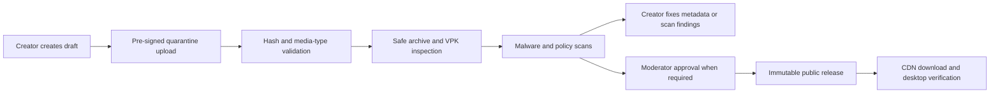
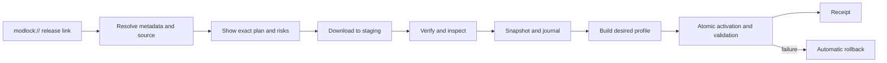

# Product specification

## Product principles

1. **Safe by construction.** A failed install must leave the game recoverable.
2. **Creator-controlled.** Attribution, licenses, source links, and pack consent are first-class data.
3. **Light when closed and light when open.** No tray process, background updater, or polling agent remains after exit unless the user explicitly opts into one later.
4. **Honest compatibility.** “Unknown” is better than an invented compatible badge.
5. **Offline-capable utility.** Already-downloaded mods, profiles, CFG editing, backup, and repair work without the service.
6. **No competitive automation.** The product does not inject, read/write game memory, automate inputs, or distribute gameplay-advantage presets.

## Users

| User | Primary needs |
|---|---|
| Player | Find trustworthy mods, install safely, switch profiles, recover after a patch. |
| Creator | Publish immutable releases, manage media/metadata, declare compatibility, receive attribution and donations. |
| Streamer/pro | Approve a public preset or pack, version it, and withdraw or update it without impersonation. |
| Curator | Assemble reference-based collections without reuploading other creators' work. |
| Moderator | Review files, handle reports/takedowns, inspect provenance and scan evidence, suspend unsafe releases. |

## Part 1 — website

### Public catalog

- Home, browse, search, trending, recently updated, categories, hero tags, and safe NSFW controls.
- Mod detail pages with creator, license, provenance, media, versions, files/variants, dependencies, conflicts, compatible game build, scan status, changelog, download count, and source link.
- Creator and verified-player pages.
- Crosshair and CFG preset galleries with a structured preview/diff.
- Pack pages that enumerate every referenced release, file, variant, and load-order decision.
- “Open in Modlock” links plus a normal manual download path where licensing allows it.
- Report, copyright/takedown, malware, impersonation, and competitive-advantage reporting.

### Creator dashboard

- Account and identity linking.
- Draft mod/release workflow.
- Direct-to-quarantine multipart uploads through expiring pre-signed URLs.
- Scan/validation results that identify the exact rejected entry or path.
- Media management and content warnings.
- License selection or custom-license declaration.
- Game-build compatibility and capability declaration.
- Co-author and maintainer roles.
- Donation link management.
- Release deprecation, not silent binary replacement.
- Pack/preset approval and revocation requests.

### Moderation console

- Queue views for new creators, uploads, scan failures, user reports, NSFW review, takedowns, and appeals.
- Immutable evidence record: uploader, source IP risk signals, original hash, scanner versions, archive manifest, moderator actions, and timestamps.
- Quarantine/revoke controls that immediately prevent new installs while preserving internal evidence.
- Hash-level blocking for known malware or repeated prohibited uploads.
- Creator impersonation and verified-player approval workflow.

## Part 2 — desktop utility

### Library and installs

- Discover Steam libraries and Deadlock app ID 1422450.
- Browse/search online sources and inspect local library offline.
- One-click deep link with a complete confirmation sheet before mutation.
- Install ZIP/RAR/7z/raw VPK variants using bounded streaming extraction.
- Enable, disable, uninstall, repair, and update.
- Profiles, deterministic load order, and visible file conflicts.
- Pin a version; never silently move a pack to “latest.”
- Transaction journal, snapshots, recovery after process/power interruption, and one-click rollback.
- Game-patch detection, managed-file integrity check, and safe repair.
- No requirement for administrator privileges.

### CFG workspace

- Syntax-aware plain CFG editor for advanced users.
- Typed setting forms for supported commands.
- Searchable command library with range/type, description, risk class, source, tested game build, and deprecation state.
- Before/after diff for every preset application.
- Owned marker blocks so unrelated user config survives.
- Backup timeline and restore.
- Conflict reconciliation for persisted machine convars.
- Writes only while the game is closed unless a setting is proven safe for live reload.

Preset safety classes:

| Class | Examples | Default behavior |
|---|---|---|
| Cosmetic | crosshair geometry/color, HUD preferences | Allowed after validation. |
| Accessibility | supported visibility/audio/UI settings that do not expose hidden information | Reviewed and allowed. |
| Performance | curated renderer settings known to be supported | Explicit diff; hardware-specific files excluded. |
| Gameplay/input | binds and sensitivity | Local editing allowed; publishing requires review. |
| Competitive-risk | outlines, fog/visibility removal, automated actions, hidden-information exposure | Prohibited from hosted presets. |
| Unknown/arbitrary command | unclassified command/script | Never auto-applied from a public preset. |

### Crosshairs

- Visual editor with exact numeric values and live local preview.
- Copy/paste/share code and versioned hosted preset.
- Filter by hero, player, style, color, and game build.
- Save a preferred preset for each hero.
- Explicitly apply the selected preset to the owned config block.
- Display whether the currently active game file matches the saved preset.

The per-hero mapping is initially organizational and pre-launch/manual activation. Automatic in-match switching is an experimental research track, not an MVP commitment.

### Player and streamer presets

Every published player artifact contains:

- Player/creator identity and public source links.
- Status: `creator_verified`, `creator_contributed`, `community_reported`, or `expired`.
- The approver and approval timestamp.
- `last_verified_at` and the Deadlock build tested.
- An immutable version and changelog.
- Structured values, not an opaque full CFG download.
- A visible disclaimer when the player has not endorsed the entry.

Do not scrape private streams, Discord attachments, or local files. A community-reported preset must cite a public source, cannot use an endorsement badge, and expires unless periodically rechecked.

### Packs

A pack is a resolver manifest, not a ZIP containing redistributed mods. It pins:

- Each mod source and immutable release/file ID.
- SHA-256 when the source supplies a stable binary.
- Variant selection.
- Load-order priority.
- Required/optional status.
- Known conflicts and replacement choices.
- Pack creator approval and version.

Install UX shows all authors, hosts, content warnings, file sizes, permissions/capabilities, conflicts, and unavailable entries before the user confirms. The resolver downloads each item from its authorized host and produces a receipt.

## Key flows

### Hosted mod publication

### One-click install

## MVP acceptance criteria

- At least 25 representative mods in the fixture catalog, including split VPKs and multi-variant archives.
- A hosted upload cannot become public until every binary has a SHA-256, file inventory, scan result, and provenance/license status.
- An interrupted install can be resumed or rolled back on the next launch.
- The app never edits Deadlock's base `pak01_dir.vpk`.
- It detects an open game and blocks unsafe mutations.
- Profile switching is deterministic and produces the same active-tree hash from the same manifest.
- A patch-reset `gameinfo.gi` is detected and repaired without destroying new Valve content.
- CFG preset application shows a diff and retains unrelated lines.
- Pack install cannot bypass individual file policy or scan state.
- Accessibility works with keyboard and Windows screen-reader APIs in the chosen shell.
- Performance gates in the executive brief pass on the reference PC.

## Explicit non-goals for V1

- Cheats, memory/process injection, anti-cheat workarounds, input automation, or hidden-information overlays.
- Automatic arbitrary per-hero crosshair switching without a supported game mechanism.
- Executing scripts or binaries from downloaded mods.
- Mirroring files without rights.
- VPK merge by default.
- A social network, public comments, or direct messaging.
- A permanently running tray agent.
- Mobile clients.
