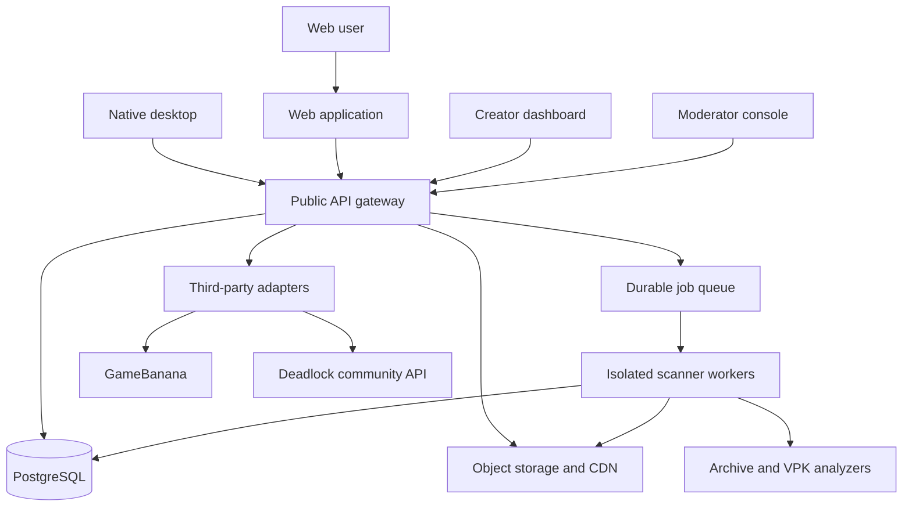

# Platform architecture and API

## System overview



## Recommended stack

This is a starting architecture, not a locked vendor decision.

| Layer | Recommendation | Why |
|---|---|---|
| Web | Next.js/React | Strong catalog/content UX, server rendering, familiar TypeScript contracts. |
| API | TypeScript with Hono or a small Rust service | Start with team velocity; isolate scanners/install parsing in Rust. |
| Database | PostgreSQL | Relational provenance, release, moderation, and pack data benefit from constraints and transactions. |
| Jobs | PostgreSQL-backed durable queue initially | Avoid operating Redis until throughput proves the need; jobs need leases, retries, and idempotency. |
| Files | S3-compatible object storage such as R2 plus CDN | Direct multipart upload, immutable objects, lifecycle control, broad tooling. |
| Scanner | Rust worker in an isolated container/microVM | Shared safe parsers with desktop; strict CPU/memory/time/network limits. |
| Contracts | OpenAPI 3.1 plus JSON Schema | Generate web, desktop, and scanner clients; version external manifests explicitly. |
| Observability | Structured logs, traces, metrics, audit events | Separate operational telemetry from optional product analytics. |

Avoid coupling domain code to a storage provider. Define blob, queue, mail, and identity ports so providers can change without rewriting release logic.

## Service boundaries

### Catalog API

Owns mods, releases, variants, search, categories, heroes, creators, presets, packs, compatibility, and public download resolution.

### Upload service

Creates short-lived multipart upload sessions scoped to one draft release. The client uploads directly to quarantine storage. Completion verifies object size and checksum before creating scan jobs.

### Scanner

Runs without production database credentials beyond a narrow job/result channel. It receives an immutable object ID and limits, performs analysis, and writes a signed/attested result. It cannot promote a release.

### Moderation

Combines automated findings with policy state. Publishing is a state-machine transition with authorization checks, not a direct update from the creator client.

### Third-party adapters

Normalize external identities and metadata while retaining the raw external record for diagnostics. No adapter response is trusted to authorize rehosting.

## Core data model

Names are illustrative; IDs should be sortable opaque identifiers and all timestamps UTC.

| Entity | Important fields/relationships |
|---|---|
| `users` | status, display name, created time; private account identity. |
| `identities` | user, provider, provider subject, scopes; unique per provider subject. |
| `creators` | public profile, ownership user/team, verification state. |
| `creator_verifications` | method, evidence, reviewer, approval/expiry/revocation. |
| `mods` | creator, slug, title, summary, status, source provenance, content rating. |
| `mod_releases` | mod, immutable version, changelog, game-build range, publish/revoke status. |
| `release_files` | release, blob/external ref, variant, filename, size, SHA-256, scan state. |
| `blobs` | object key, SHA-256, byte size, media type, quarantine/public state. |
| `scan_reports` | blob, scanner build, signatures, archive/VPK inventory, findings, limits. |
| `external_refs` | provider, remote type/id/file id, canonical URL, fetched payload/hash/time. |
| `licenses` | SPDX expression or custom text/link, redistribution permission state. |
| `heroes/categories/tags` | normalized taxonomy with aliases and source snapshot. |
| `cfg_presets` | owner, public status, verification class, risk classification. |
| `cfg_preset_versions` | immutable settings JSON, source, tested build, approval/expiry. |
| `crosshairs` | owner and public metadata. |
| `crosshair_versions` | validated typed values, preview artifact, tested build. |
| `packs` | owner, verification/consent state, presentation. |
| `pack_versions` | immutable manifest, resolver status, tested build. |
| `pack_items` | pack version, release/external file, variant, priority, required flag. |
| `compatibility_reports` | subject version, game build, status, evidence/reporter. |
| `reports` | reporter, target, reason, evidence, status. |
| `moderation_cases` | assigned reviewer, policy reason, decisions, appeal chain. |
| `audit_events` | actor, action, target, before/after digest, request correlation. |
| `download_events` | privacy-minimized aggregate event, source/release, coarse client version. |

Critical invariants:

- Published release bytes are immutable. A creator publishes a new version instead of replacing a file.
- A public hosted file points only to a completed clean scan report produced for its exact SHA-256.
- Revocation blocks new resolution but preserves internal evidence.
- External references cannot claim redistribution permission merely because they are downloadable.
- A verified pack/preset approval applies to one immutable version and can expire/revoke.

## Public API outline

Prefix all routes with `/v1`. Cursor-pagination is mandatory for collections.

```text
GET    /v1/mods?cursor=&query=&hero=&category=&source=&sort=
GET    /v1/mods/{mod_id}
GET    /v1/mods/{mod_id}/releases
GET    /v1/releases/{release_id}
POST   /v1/releases/{release_id}/resolve

GET    /v1/packs?cursor=&owner=&verification=
GET    /v1/packs/{pack_id}/versions/{version_id}
POST   /v1/pack-versions/{version_id}/resolve

GET    /v1/cfg-presets?cursor=&owner=&hero=&verification=
GET    /v1/cfg-preset-versions/{version_id}
GET    /v1/crosshairs?cursor=&owner=&hero=&verification=
GET    /v1/crosshair-versions/{version_id}

POST   /v1/upload-sessions
POST   /v1/upload-sessions/{id}/complete
GET    /v1/releases/{release_id}/scan-status
POST   /v1/mods/{mod_id}/releases
POST   /v1/releases/{release_id}/submit

POST   /v1/reports
GET    /v1/desktop/bootstrap
GET    /v1/game-data/snapshot
```

`resolve` returns a short-lived install plan, not a blind URL:

```json
{
  "schema_version": 1,
  "resolution_id": "res_...",
  "expires_at": "2026-08-26T20:15:00Z",
  "release": { "id": "rel_...", "version": "1.3.0" },
  "source": {
    "kind": "modlock-hosted",
    "canonical_page": "https://modlock.example/mods/example"
  },
  "files": [
    {
      "id": "file_...",
      "name": "example.zip",
      "size": 7340032,
      "sha256": "hex-encoded-sha256",
      "download_url": "short-lived-https-url",
      "scan_attestation": "att_..."
    }
  ],
  "capabilities": ["vpk.cosmetic"],
  "warnings": [],
  "signature": "server-signature-over-canonical-payload"
}
```

The desktop validates schema, expiry, signature, allowed host, size, and final hash. External-host plans may omit a stable hash only when clearly marked; those require fresh local scanning and a stronger confirmation state.

## Upload and publication state machine

```text
draft
  -> uploading
  -> quarantined
  -> scanning
  -> needs_creator_action | needs_moderation | rejected
  -> approved
  -> published
  -> revoked | deprecated
```

Each transition is idempotent and records actor/reason. A job lease can expire and retry, but the blob digest prevents duplicate analysis from changing identity.

### Scan pipeline

1. Validate declared length, media type, magic bytes, and SHA-256.
2. Enforce compressed-byte, expanded-byte, entry-count, nesting, path-length, and time limits.
3. Reject traversal, absolute paths, links, devices, alternate streams, and unexpected executable content.
4. Extract in an isolated environment with no outbound network.
5. Run anti-malware signatures and policy/YARA rules.
6. Parse VPK headers/trees, split-part relationships, internal paths, and collisions.
7. Infer requested capabilities conservatively; never let uploader declarations lower risk.
8. Process images/video through safe re-encoding.
9. Store a canonical inventory and scanner version.
10. Route clean/known content to policy moderation or auto-approval rules.

## Hosted package manifest

Modlock generates this manifest from inspected content; uploaders do not control the final hashes or inventory.

```json
{
  "manifest_version": 1,
  "mod_id": "mod_...",
  "release_id": "rel_...",
  "version": "1.3.0",
  "game": { "app_id": 1422450, "tested_builds": ["build-id"] },
  "variants": [
    {
      "id": "default",
      "label": "Default",
      "files": [
        {
          "source_path": "payload/example_dir.vpk",
          "target_kind": "vpk-addon",
          "sha256": "hex-encoded-sha256",
          "size": 1234
        }
      ]
    }
  ],
  "capabilities": ["vpk.cosmetic"],
  "requires": [],
  "conflicts": [],
  "license": { "spdx": "CC-BY-4.0" }
}
```

Packs remain separate and reference release/variant identities. They never embed this release's payload.

## Third-party adapter contract

An adapter exposes:

```text
discover(cursor, filters) -> normalized summaries + source cursors
get_submission(remote_id) -> normalized record + raw digest
list_files(remote_id) -> remote files, permissions, attribution
resolve_file(remote_id, file_id) -> expiring source URL/redirect metadata
health() -> schema probe, rate status, last successful sync
```

Operational rules:

- Cache conditional responses and honor source rate limits.
- Store last-known-good normalized metadata; show its age during outages.
- Validate every upstream response against a pinned schema.
- Circuit-break on breaking changes rather than emitting corrupt install plans.
- Never send source credentials or server keys to the desktop.
- Maintain source-specific takedown and attribution behavior.

## Authentication and authorization

- Use short-lived browser sessions and rotating refresh tokens for the website.
- Desktop authorization uses system-browser OAuth with PKCE and a loopback/custom-protocol completion flow.
- Custom protocol payloads contain only opaque one-time state; no bearer tokens in URLs.
- Roles are capability-based: creator ownership, team maintainer, moderator, takedown specialist, administrator.
- High-risk moderation and identity verification changes require step-up authentication and immutable audit events.
- Public downloads need not require login unless rate abuse or legal obligations demand it.

## Reliability and privacy

- Multi-AZ managed PostgreSQL, tested point-in-time recovery, object versioning, lifecycle rules, and restore drills.
- Idempotency keys for upload completion, publication, and resolution.
- CDN downloads are immutable and cache-keyed by digest/version.
- Do not log full authorization headers, pre-signed URLs, local game paths, Steam IDs, or CFG contents.
- Product analytics are opt-in. Security/operational events use coarse identifiers and documented retention.
- Publish a service status page and source-adapter health separately so users can distinguish Modlock failures from GameBanana outages.
