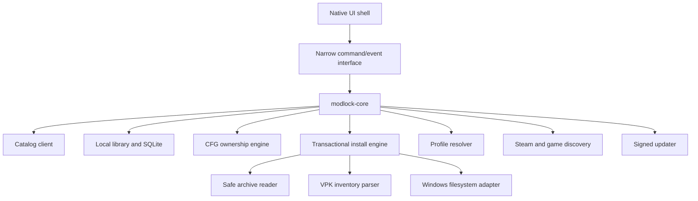

# Native desktop technical design

## Architecture decision

The file-system/install engine should be a Rust library independent of the UI. Two native shells enter a benchmark spike:

### Option A — WinUI 3 plus Rust core

- C++/WinRT WinUI 3 presentation layer.
- Rust core compiled as a static/dynamic library with a deliberately small C ABI.
- Native Windows accessibility, windowing, notifications, file pickers, and visual language.
- More FFI, build, lifetime, and error-translation work.

### Option B — all-Rust native UI

- Rust core and native Rust UI toolkit such as Iced.
- One language and simpler packaging.
- No webview and good control over background work.
- Less native Windows polish and a smaller accessibility/control ecosystem.

Tauri is the fallback if the spike proves native presentation too costly. Electron is outside the performance brief. The benchmark must use production-like list virtualization, thumbnails, SQLite queries, archive progress, accessibility, deep links, updater bootstrap, and signed packaging—not a blank-window hello world.

## Component map



Core operations are asynchronous and cancellable. The UI receives typed progress events and never reaches directly into installer directories or SQLite.

## Local layout

```text
%LOCALAPPDATA%\Modlock\
  db\modlock.sqlite3
  objects\sha256\ab\abcdef...          immutable downloaded objects
  extracted\<object-hash>\              inspected immutable trees
  profiles\<profile-id>\manifest.json   desired state
  staging\<transaction-id>\             incomplete transaction work
  journals\<transaction-id>.json        durable write-ahead record
  backups\<game-instance>\...           bounded managed-file snapshots
  logs\                                  privacy-filtered rolling logs
  updates\                               verified updater staging
```

The object store deduplicates downloads. Profile activation uses hardlinks when the target volume and permissions support them; otherwise it uses copies. Never symlink into untrusted or network-controlled locations by default.

SQLite uses WAL mode, foreign keys, migrations, and explicit transactions. Store secrets through Windows Credential Manager/DPAPI, not SQLite.

## Steam and game discovery

1. Read Steam's registered installation location.
2. Parse `libraryfolders.vdf` with a real VDF parser.
3. Locate `steamapps/appmanifest_1422450.acf` in each library.
4. Resolve and canonicalize the install directory.
5. Verify expected Deadlock files and record the game build/depot metadata.
6. Let the user override only after validation; retain multiple installations as separate game instances.

Every path crossing the UI/core boundary is canonicalized. Reject UNC/device paths unless a future explicit network-library mode safely supports them. Handle long Windows paths and Unicode without lossy conversion.

## Desired-state profiles

A profile manifest contains:

```json
{
  "schema_version": 1,
  "profile_id": "profile_...",
  "name": "Main",
  "game_instance_id": "game_...",
  "entries": [
    {
      "source": "modlock",
      "release_id": "rel_...",
      "file_id": "file_...",
      "variant": "default",
      "object_sha256": "hex-encoded-sha256",
      "enabled": true,
      "priority": 10
    }
  ],
  "cfg_selection": {
    "preset_version_ids": [],
    "crosshair_version_id": null
  }
}
```

The resolver produces a full desired tree and reports:

- missing objects;
- duplicate internal VPK paths;
- incompatible or revoked releases;
- unresolved external files;
- split VPK parts;
- priority ties;
- capacity warnings; and
- game-build compatibility state.

Activation is deterministic: sort by explicit priority, then immutable entry ID as a stable tie-break. The numbered filename is generated output, never the identity of the mod.

## Transactional install and activation

### Invariants

- Never modify the game's base `pak01_dir.vpk`.
- Never stream a download directly into the active game directory.
- Never replace a managed file without an fsynced journal and recoverable prior state.
- Never trust filename extensions over magic bytes and parsed structure.
- Never mutate configs or active VPKs while Deadlock is running.
- A cancellation is an expected state transition, not an exceptional partial write.

### Transaction sequence

1. Acquire a per-game-instance OS lock.
2. Confirm the game is closed and the install root still matches its recorded identity.
3. Resolve the exact release/file and expected size/hash.
4. Download into a new staging directory using bounded buffers and resumable ranges where supported.
5. Verify length and SHA-256; run local archive/VPK checks even for server-scanned files.
6. Extract into a separate staging tree under strict limits.
7. Build the complete desired active tree and conflict report.
8. Snapshot only files Modlock will change, including the current `gameinfo.gi` digest and content.
9. Write and flush a journal containing every intended source, target, old digest, new digest, and rollback location.
10. Materialize the new profile in a sibling temporary directory.
11. Patch the smallest owned marker block in `gameinfo.gi`, preserving Valve's current file content.
12. Atomically rename/swap the active managed directory where filesystem semantics permit; otherwise use a two-phase rename with rollback names.
13. Re-read and validate active hashes, VPK sequence, search path, and CFG ownership blocks.
14. Commit SQLite desired/current state and mark the journal complete.
15. Retain a bounded rollback snapshot and delete staging later.

If any step after the journal fails, execute rollback in reverse order. On next launch, incomplete journals are inspected before any new mutation; the app offers/resumes safe rollback automatically.

### `gameinfo.gi` patching

Do not store and restore an entire old copy after a game patch. Parse the current file, locate the search-path structure, and insert/remove a uniquely identified Modlock-owned entry. Record before/after digests and the semantic change. If parsing or the expected structure fails, stop and show repair guidance rather than guessing.

Backups remain useful for user recovery, but they are not a substitute for patching the latest Valve file.

## Archive security

Default limits should be server-configurable within hard client ceilings. The spike should validate reasonable values against the fixture corpus.

Reject or stop on:

- absolute, parent-traversal, drive-relative, UNC, device, reserved-name, or alternate-data-stream paths;
- symlink, junction, hardlink, reparse-point, FIFO, socket, or device entries;
- nested archives beyond policy;
- excessive compression ratio, expanded bytes, file count, depth, or path length;
- encrypted/password-protected archives;
- files that change while hashing/reading;
- executable/DLL/driver/script payloads for ordinary VPK mod releases; and
- malformed, overlapping, or resource-exhausting VPK structures.

Create files with exclusive semantics in a fresh private staging directory. After extraction, walk the actual filesystem without following reparse points and compare it with the planned inventory.

RAR/7z support must use a maintained library/tool with a clear redistribution license and sandbox boundary. If safe support is not ready, launch with ZIP and raw/split VPK rather than bundling an opaque extractor.

## VPK inventory and conflicts

The VPK parser returns package identity, tree paths, split archive relationships, sizes/checksums when present, malformed ranges, and capability hints. Conflict analysis compares normalized internal paths across enabled packages.

V1 does not need to understand or render every Source 2 resource. It needs to safely enumerate and make collision/load-order behavior legible. A future merge engine is isolated behind a feature flag and never alters the content-addressed originals.

## CFG ownership model

Maintain a structured local document and render a clearly owned section:

```text
// >>> MODLOCK MANAGED START v1; DO NOT EDIT THIS BLOCK
citadel_crosshair_color_r 255
citadel_crosshair_color_g 255
citadel_crosshair_color_b 255
// <<< MODLOCK MANAGED END v1
```

Before writing:

1. Read current bytes and line-ending/encoding characteristics.
2. Parse existing markers; reject nested/duplicated/corrupt ownership blocks.
3. Create a timestamped backup and digest.
4. Render deterministically from validated typed values.
5. Write a sibling temp file, flush, and atomically replace.
6. Re-read and verify.

Never overwrite content outside the owned block. Show the user when external edits changed the file since last read. A raw editor may edit outside the block only through an explicit advanced mode and still receives backup/diff protection.

### Typed command registry

Each supported key contains:

```json
{
  "name": "citadel_crosshair_color_r",
  "type": "integer",
  "minimum": 0,
  "maximum": 255,
  "default": 255,
  "risk": "cosmetic",
  "applies_to": "autoexec",
  "introduced_build": "observed-build-id",
  "last_verified_build": "observed-build-id",
  "source": "source-url-or-test-id"
}
```

The registry ships as a signed snapshot with the client and can receive signed updates. A server preset can use only keys the installed client knows and allows. Unknown keys appear as unsupported and are never automatically written.

`video.txt`, complete `gameinfo.gi` files, and hardware-specific identifiers are never part of a public CFG preset. Persisted values in `machine_convars.vcfg` are reconciled only for an allowlisted key and with a visible backup/diff.

## Crosshair model

Crosshairs store only validated typed values plus presentation metadata. The preview renderer is a Modlock approximation and must be labelled as such; a game screenshot is the final visual authority.

```json
{
  "schema_version": 1,
  "values": {
    "citadel_crosshair_color_r": 255,
    "citadel_crosshair_color_g": 240,
    "citadel_crosshair_color_b": 0,
    "citadel_crosshair_pip_opacity": 1.0
  },
  "hero_preferences": ["hero_canonical_id"],
  "tested_game_build": "build-id"
}
```

Local per-hero preferences map a hero identifier to a crosshair version. V1 activation is user-initiated. A research prototype may read a log-derived current hero, but must not automatically mutate the live game until Valve-supported behavior and anti-cheat safety are confirmed.

## Game patch handling

Record on every successful launch/activation:

- app manifest build ID and relevant depot metadata;
- digests of managed game files;
- parser/command-registry version;
- profile tree hash; and
- last successful launch/activation time.

When the build changes:

1. Enter safe mode before modifying anything.
2. Revalidate paths and `gameinfo.gi` structure.
3. Compare managed markers and active-tree hashes.
4. Flag presets/releases whose tested-build range does not include the new build.
5. Offer a dry-run repair and exact diff.
6. Activate only after validation/user confirmation according to policy.

“Compatible” means tested or author-declared with evidence. Otherwise show `unknown`; do not equate “downloadable” with “compatible.”

## Deep links

Register one canonical scheme such as:

```text
modlock://install/release/<opaque-id>?state=<one-time-nonce>
modlock://install/pack/<opaque-version-id>?state=<one-time-nonce>
```

The app ignores host-supplied filenames, URLs, hashes, and install paths. It exchanges the opaque ID/nonce with the HTTPS API, then displays a confirmation plan. Enforce length/character limits, single-instance forwarding, replay protection, and no automatic install on invocation.

GameBanana one-click registration is a separate integration requiring its approval and source adapter. Do not impersonate another manager's custom protocols.

## Updating and code signing

- Sign Windows binaries and installers with an organization code-signing certificate.
- Publish signed update metadata with version, channel, minimum updater, file size, SHA-256, expiry, and rollback protection.
- Verify metadata signature and payload hash before staging.
- Use a small bootstrapper that can atomically replace the app after exit and recover from interruption.
- Support stable/beta channels; never silently downgrade.
- Keep TLS verification standard; content signatures/hashes provide artifact integrity without brittle certificate pinning.
- Produce an SBOM, lock dependencies, scan releases, and retain reproducible-build evidence where feasible.

## Performance engineering

- No background process after window close.
- SQLite paging and virtualized lists; never materialize an 8 MB third-party catalog on the UI thread.
- Decode thumbnails off the UI thread and bound memory/disk caches.
- Stream network, hashing, extraction, and copy operations with cancellation.
- Lazy-load network catalog after the local library is interactive.
- Avoid polling; use explicit refresh and modest in-session intervals.
- Instrument startup phases locally in development builds.
- Benchmark cold/warm start, 10/1,000/10,000 library items, a large archive, a slow disk, and offline mode.

## Test matrix

| Area | Required fixtures/tests |
|---|---|
| Paths | Unicode, long paths, reserved names, case collisions, UNC/device attempts. |
| Archives | ZIP slip, links/reparse points, zip bomb, excessive entries, nested archive, encrypted file, truncated archive. |
| VPK | raw, split, malformed header/tree/ranges, multiple variants, duplicate internal paths, large resource. |
| Transactions | cancellation at every step, power-loss simulation, locked target, disk full, antivirus quarantine, concurrent invocation. |
| Patches | `gameinfo.gi` replaced, structure changed, marker duplicated, base path moved, build changed. |
| CFG | mixed line endings, BOM, malformed markers, external edit race, duplicate keys, invalid values, cloud sync race. |
| Profiles | stable ordering, missing/revoked item, unavailable external host, same mod twice, rollback across profile switch. |
| Security | malicious deep link, expired/replayed resolution, wrong hash/size/host, compromised cache, unsigned update. |

Run destructive install tests against disposable Deadlock-like fixture trees, never a developer's live installation. Add opt-in end-to-end tests against a sacrificial copy for each supported game build.
