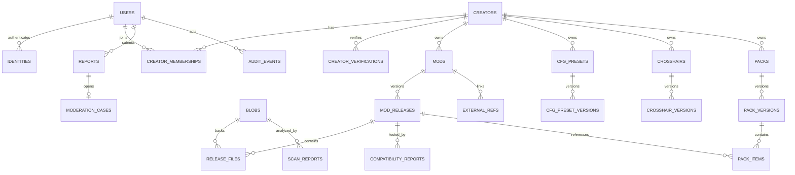

# Data model and ERD

Status: proposed logical model  
Last reviewed: 2026-09-01

## Invariants

1. Public release bytes and their blob digest never change.
2. One public hosted file has exactly one clean/approved scan attestation for the same blob and required scanner-policy version.
3. External references never imply redistribution rights.
4. Pack items reference immutable release/file identities or explicit third-party identities; no payload bytes live in a pack.
5. Artifact approval applies to one immutable preset/pack version, not an owner forever.
6. Revocation prevents new resolution but preserves evidence and audit history.
7. User authentication identity is private; public creator identity is a separate entity.
8. Hard deletion is prohibited for published/security/legal evidence until retention policy permits it.

## Lifecycle model

- Draft entities may be edited and deleted by owners.
- Submitted releases become immutable in identity and are state-transitioned through quarantine/scanning/moderation.
- Published records may be deprecated or revoked, not rewritten.
- User deletion anonymizes eligible personal account fields while retaining minimized legal/security/audit records according to the approved retention schedule.
- Third-party snapshots retain a payload digest and observation time, not necessarily the entire upstream response indefinitely.

