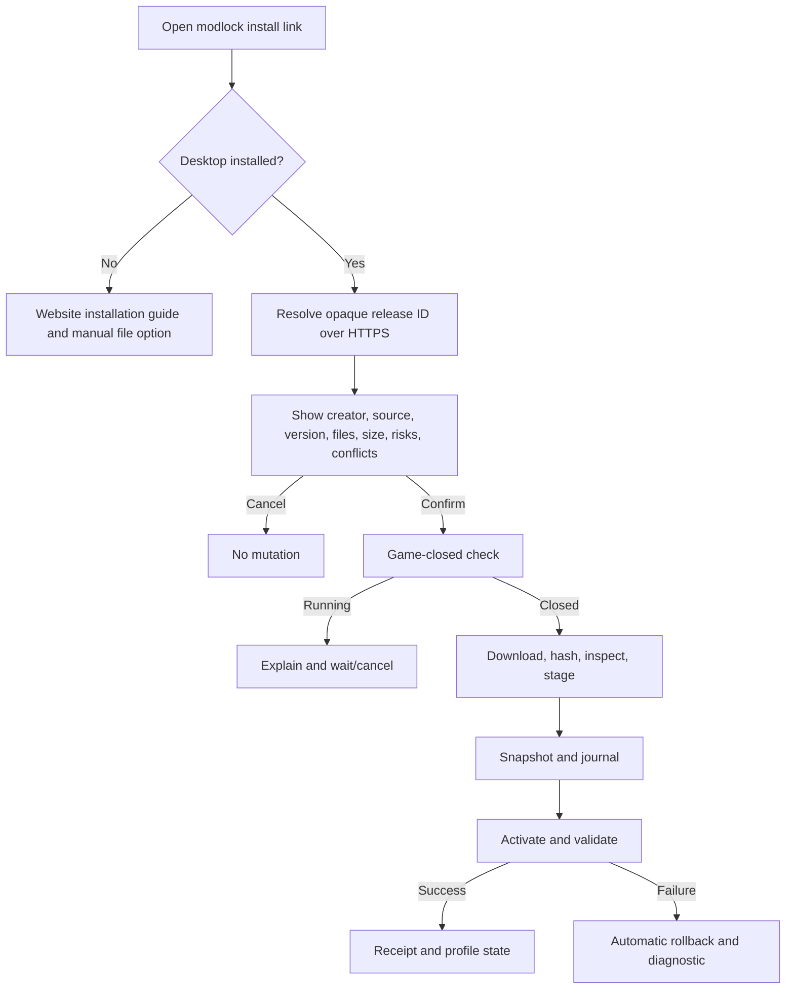
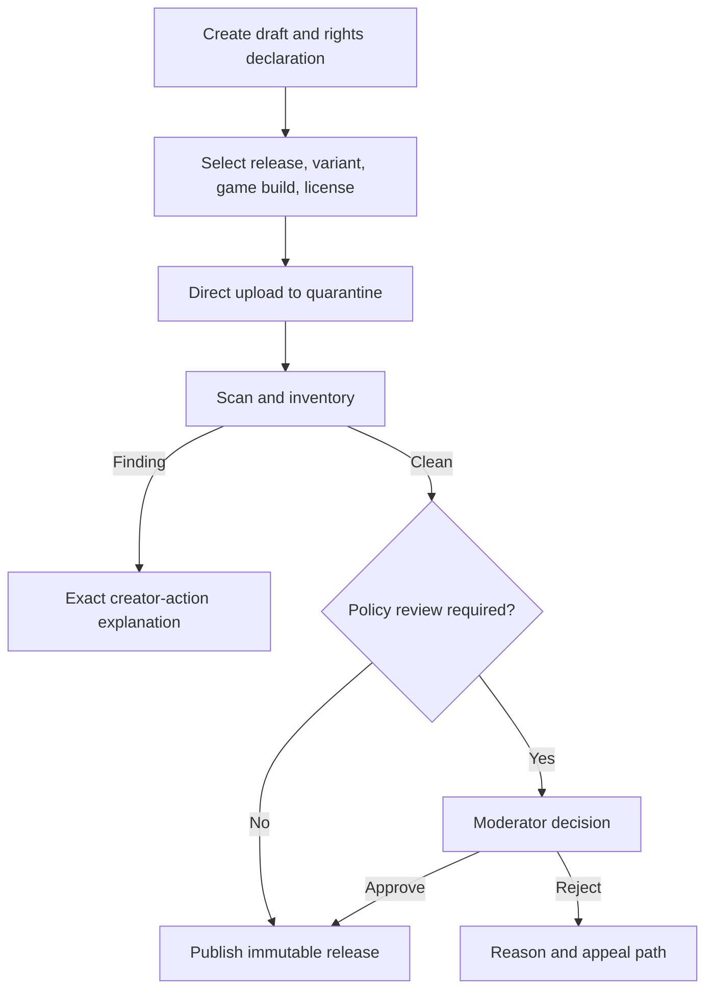

# Information architecture and critical wireflows

Status: proposed  
Last reviewed: 2026-09-01

## Website route inventory

```text
/
/mods
/mods/{slug}
/mods/{slug}/releases/{version}
/creators/{slug}
/packs
/packs/{slug}
/presets/cfg
/presets/crosshairs
/presets/{type}/{slug}
/auth/sign-in
/dashboard
/dashboard/mods/{id}
/dashboard/mods/{id}/releases/new
/dashboard/packs/{id}
/dashboard/identity
/moderation/queue
/moderation/cases/{id}
/reports/new
/legal/{terms,privacy,content,dmca,creator}
/help
/status
```

Public pages communicate source provenance, creator, immutable version, license, content rating, game-build evidence, file/variant, scan status, and whether installation opens the desktop utility. Search and browsing remain usable without an account.

## Desktop navigation

```text
Onboarding
Library
Discover
Profiles
Configuration
  CFG
  Crosshairs
Packs
Activity
  Transactions
  Backups and recovery
Settings
  Game and Steam
  Downloads and storage
  Updates
  Privacy
  Advanced diagnostics
```

The local library becomes interactive before remote discovery. Recovery state overrides normal navigation after an incomplete transaction.

## Critical wireflow: first install



## Critical wireflow: creator publication



## Critical wireflow: patch recovery

1. Desktop detects a new Steam/game build or changed managed file.
2. It enters safe mode before mutation.
3. It compares current semantic structure and profile object hashes with recorded state.
4. It presents a dry-run repair and compatibility unknowns.
5. User confirms; Modlock journals the repair and validates or rolls back.
6. Compatibility remains `unknown` until evidence upgrades it.

## Content hierarchy

On every catalog/install surface, present identity and safety before popularity:

1. title and creator/source;
2. version/updated/tested game build;
3. capability/content warnings and verification;
4. files/variants/license/provenance;
5. dependencies/conflicts/load-order effects;
6. media/description/changelog;
7. counts and community signals.

