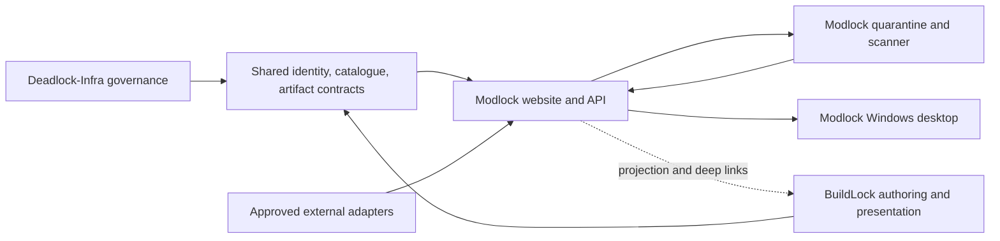

# Modlock project control packet

| Field | Value |
|---|---|
| Audit timestamp | `2026-09-01T01:28:24-07:00` |
| Project | `Modlock` |
| Repository | `/Users/ahad/Dev/modlock` and [buildlock/modlock](https://github.com/buildlock/modlock) |
| Linear project | [Modlock](https://linear.app/shopliftdigital/project/modlock-72fa0f6e1ed8) |
| Audited base | `1f2ba12999c39b9441ff279635df8db9b0702bec` on protected `main` |
| Documentation branch | `codex/project-control-packet` |
| Scope | Documentation and deterministic planning only; no runtime, provider, production, migration, permission, credential, deployment, or merge mutation. |

## Evidence labels

Every material state claim in this packet uses one of these labels.

| Label | Meaning in this packet |
|---|---|
| **VERIFIED CURRENT** | Directly observed in the named repository, GitHub, CI, Linear, or Graphify during the audit window. |
| **IMPLEMENTED BUT UNMERGED** | Source exists outside current `main`, but is not accepted repository state. |
| **MERGED BUT DISABLED** | Source is on `main`, but an activation, migration, provider, or feature flag is off. |
| **SYNTHETIC OR TEST-ONLY** | Evidence uses controlled fixtures and does not prove real game, provider, user, or production behavior. |
| **TARGET STATE** | Intended product or architecture, not current implementation evidence. |
| **HISTORICAL** | Accurate for a dated prior checkpoint and not current authority. |
| **UNKNOWN OR UNVERIFIED** | The audit did not establish the claim, or it requires outside authority/evidence. |

## Project purpose

Modlock exists to make discovering and locally using Deadlock mods safer, easier, attributable, and recoverable. It is intended for players who want one-click installs, profiles, CFG and crosshair tools, and trusted creator packs; creators and pro/streamer representatives who need versioned publishing and approval controls; and moderators/operators who must govern risky files and claims. The two-part product is a public catalog/upload/showcase website plus a small native Windows utility that applies signed install plans through a journal, backups, deterministic conflict handling, and rollback.

### Portfolio relationship

**TARGET STATE:** Deadlock-Infra governs shared identity, creator, catalogue, artifact-version, job, policy, and audit semantics. BuildLock remains the build-authoring/community surface and may render, edit, share, and export structured setup artifacts or show Modlock-backed mod lists. Modlock owns canonical mod metadata/releases, quarantined binaries and scan attestations, pack resolution, and every local install/reconcile/backup/rollback action. Modlock must not depend on BuildLock UI, private tables, runtime credentials, or availability, and BuildLock must not become a second canonical mod registry.

**VERIFIED CURRENT:** Modlock has no shared-package dependency, database role, migration, service, deployment, identity integration, or scanner. BuildLock is the currently implemented portfolio runtime/data owner. The two published `@buildlock/deadlock-*` packages cover an event envelope and a PostgreSQL transaction helper, not a complete Modlock identity/catalogue/artifact/job contract; cross-repository consumer access is not proven. The broader one-platform and isolated-mod-trust-zone decisions remain proposed in Deadlock-Infra, not deployed Modlock integration.

### Non-goals

- No injection, process-memory access, input automation, matchmaking manipulation, cheat behavior, anti-cheat bypass, or unsupported live hero detection.
- No editing or replacing Valve-owned base packages; only Modlock-owned paths and bounded CFG blocks may be changed.
- No blind arbitrary-URL install, opaque script execution, or archive execution.
- No automatic public rehosting from GameBanana or other providers without explicit rights and applicable provider approval.
- No false implication that a creator/pro/streamer endorses a pack; approval is identity-bound, exact-version, expiring, and revocable.
- No second identity system in Modlock or second canonical mod registry in BuildLock.
- No production activation based on documentation, local tests, synthetic fixtures, or self-review alone.

## Current product

| Surface or claim | State | What is true now | Exact evidence |
|---|---|---|---|
| What users can do | **VERIFIED CURRENT** | Users cannot use a Modlock website or desktop application today. They can read the design package and machine-readable draft contracts. | Current `main` contains no runtime manifests/source, database migrations, deployment configuration, or release artifacts; [STATUS](../../STATUS.md) and the explicitly undeployed [OpenAPI outline](../../contracts/openapi/modlock-v1.openapi.json). |
| Merged repository | **VERIFIED CURRENT** | `main` is a design/documentation repository with 29 draft feature pages, OpenAPI/JSON Schemas/examples, one offline docs validator, and one docs-only GitHub workflow. | GitHub `main` `1f2ba12`; [documentation index](../README.md); `scripts/check_docs.py`; `.github/workflows/docs.yml`. |
| Local Phase 0 candidate | **IMPLEMENTED BUT UNMERGED** | `/Users/ahad/Dev/modlock-phase0-contracts` contains stricter V1 schemas, a semantic validator, tests, and fixture controls on local branch `codex/phase0-contracts` at `0a45a899...`; it is four commits behind current main, dirty, unpushed, and has no PR. | Read-only `git worktree list`, `git status`, file inventory, and [candidate handoff](/Users/ahad/Dev/modlock-phase0-contracts/docs/handoffs/2026-08-30-codex-phase0-contracts.md). |
| Candidate evidence | **SYNTHETIC OR TEST-ONLY** | The candidate has a five-document synthetic authority graph and 13 metadata-only corpus controls; `materialized_payload_count` is zero. It is contract/harness work, not API, installer, parser, journal, Windows, or deployed product code. | Candidate `fixtures/corpus-manifest.v1.json`, tests, and handoff exclusions. |
| Candidate acceptance | **UNKNOWN OR UNVERIFIED** | Its writer reports a complete fresh gate, but this audit did not rerun or independently accept that gate. Seven canonical files and the contract layout collide with current main. | Candidate `HANDOFF.md`; source-manifest SHA `561c36ecf75137d636969f736d64a34eda19b786bc6a4ba271e7c432679eb5f3`; collision inventory below. |
| Product deployment | **UNKNOWN OR UNVERIFIED** | No Modlock deployment is represented by the repository or GitHub evidence. Any out-of-band environment is unknown; none may be treated as current. | No deployment/IaC/provider files or workflows; OpenAPI description says it is not deployed. |
| Disabled product paths | **VERIFIED CURRENT** | None exist in Modlock because no product runtime is merged. | Repository tree and Graphify query. |
| Production-proven behavior | **VERIFIED CURRENT** | Only the documentation validator is CI-proven on current main. No API, DB, scanner, desktop, Windows, game-file, provider, recovery, signing, or production behavior is proven. | Successful [Documentation run 33485327563](https://github.com/buildlock/modlock/actions/runs/33485327563); workflow contents. |
| Historical publication | **HISTORICAL** | Earlier logs reference `ahadify/modlock`; the current private remote is `buildlock/modlock`. | [Development log](../../DEVELOPMENT_LOG.md) versus live GitHub remote. |

No evidence in this audit supports a **MERGED BUT DISABLED** Modlock product capability.

## Evidence ledger

| Source | **VERIFIED CURRENT** observation | Limits |
|---|---|---|
| Git/local | Primary worktree was clean at `main` `1f2ba129...` before this docs branch. Remote/default `main` matches. A second dirty worktree has 40 changed paths. | Uncommitted work is not repository acceptance. |
| GitHub | Private `buildlock/modlock`; no open PRs; protected `main`; latest merged PR #3; no GitHub issues. Required strict check is `Validate documentation`; no approval or CODEOWNER review is required and admins are not enforced. | Branch protection is not an independent technical review by itself. |
| CI | Documentation run `33485327563` passed on current `main`. | It runs documentation validation only. |
| Linear | Project ID `ac075025-1e0a-4891-9b15-f491811a30d9`; 11 issues; SHO-127 and SHO-275 are In Progress; all others Backlog; all unassigned. | Linear status does not prove source, CI, merge, or deployment. |
| Graphify | Repository `b80fcbe9-87ce-4bc2-a02b-9c844c3f2eef`; build `66060682-8e9e-4dcf-af63-fe60f731ffab` exactly indexes `1f2ba129...` with 896 nodes. Query hash `2b5fc44f0867fcc6e20545fc6f11b745b7af8eda0dace3e75bd08eb14d76241c` surfaced the docs workflow, schemas, and docs validator rather than product runtime. | Supporting evidence only; it cannot see dirty/uncommitted work and did not establish runtime absence independently. |
| BuildLock | Remote `main` `6d42809a7d1c10724293ec75e6726ba9338af899` is the implemented portfolio runtime/data surface. | BuildLock local checkout was dirty/divergent; audit used remote-main files. |
| Deadlock-Infra | Remote `main` `e6c51e5eb61d9efa8a4d8f4c969a1776eb18192d` documents shared boundaries and the isolated mod trust zone. | Cross-product ADRs remain proposed; local Infra edits were not touched. |

### Linked-worktree collision record

The Phase 0 candidate overlaps current main at `.github/workflows/docs.yml`, `DEVELOPMENT_LOG.md`, `HANDOFF.md`, `README.md`, `STATUS.md`, `contracts/README.md`, and `docs/linear-backlog.md`. It also introduces `contracts/v1/schemas/*` beside current-main `contracts/schemas/*`. Do not mechanically rebase, copy, or merge it. The next review must produce a keep/rework/discard disposition and a path-by-path integration manifest.

## Architecture

### Component and ownership map

| Domain/component | Current state | Target owner and boundary |
|---|---|---|
| Website/catalog | **TARGET STATE** | Modlock web renders catalog, search, creator, upload, release, pack, preset, moderation, and support experiences. |
| Public API | **TARGET STATE** | Modlock exposes versioned metadata and signed, expiring resolution plans; it never exposes database or provider credentials. |
| Upload/quarantine/scanner | **TARGET STATE** | Modlock owns direct-to-quarantine upload and an isolated scanner with one-object input, hard resource/network limits, and a narrow attested-result channel. Scanner cannot publish. |
| Desktop shell/core | **TARGET STATE** | Native Windows shell plus unprivileged Rust core; local library, deterministic resolver, journal, backups, CFG ownership blocks, rollback, diagnostics, and signed updater. |
| Shared identity/creators | **UNKNOWN OR UNVERIFIED** | One portfolio account/creator model is intended, but the central issuer/session owner is undecided. Until resolved, use local/synthetic opaque IDs only. |
| Shared catalogue | **TARGET STATE** | Deadlock-Infra-governed patch, game-build, hero, setting-definition, and alias identifiers; Modlock consumes stable contracts rather than copying BuildLock tables. |
| Shared artifacts | **TARGET STATE** | Common artifact root/version/provenance/publication/lineage vocabulary; Modlock-specific release, scan, pack, and install payloads remain bounded extensions. |
| Mod catalog and binaries | **TARGET STATE** | Modlock is canonical for mods, releases, file references, scan attestations, compatibility, and packs. BuildLock may consume a projection/deep link, never own a parallel registry. |
| Local machine state | **TARGET STATE** | Modlock desktop alone owns content-addressed library, profiles, load order, CFG blocks, backups, journal, recovery receipts, and updater state. Never synchronized as opaque machine paths/secrets. |
| BuildLock setup artifacts | **TARGET STATE** | BuildLock authors/renders/shares/exports build/setup artifacts. Modlock installs only the mod/config portions through explicit versioned references. |

### External providers

| Provider/source | Current evidence | Safe boundary |
|---|---|---|
| Valve/Steam/Deadlock | **UNKNOWN OR UNVERIFIED:** no private policy approval, sacrificial-install evidence, or current-build CFG registry. | Conservative non-injection behavior; Steam discovery and bounded semantic repair only after fixtures and Windows evidence. |
| GameBanana | **VERIFIED CURRENT:** public API/download behavior has a dated teardown and defensive adapter design. **UNKNOWN OR UNVERIFIED:** terms, rate/caching permission, manager registration, and production SLA. | Metadata/source links by default; no rehosting or one-click provider install until written confirmation and contract probes. |
| Community game-data APIs | **TARGET STATE:** adapter input for build/catalog metadata. | Pin schema/source snapshot, preserve provenance, fail closed on drift, and never grant authority over installs. |
| PostgreSQL, object storage/CDN, queue, identity, email | **UNKNOWN OR UNVERIFIED:** no Modlock vendor/account/config exists. | Provider ports, least privilege, separate quarantine/public storage, expiring signed URLs, no credentials on desktop. |
| Code signing/update distribution | **UNKNOWN OR UNVERIFIED:** operator identity, keys, packaging, and Windows proof absent. | Separate authorization, custodianship, staged rings, offline recovery, SBOM, and compromise drill. |

### Shared contract/package boundary

- Current-main Modlock OpenAPI and nine JSON Schemas are **VERIFIED CURRENT design artifacts**, not generated/runtime-validated contracts.
- The local Phase 0 candidate is **IMPLEMENTED BUT UNMERGED** and introduces stricter V1 authority/rights/lifecycle semantics plus synthetic conformance tests.
- `@buildlock/deadlock-contracts@1.0.0` and `@buildlock/deadlock-platform-db@0.1.0` are **VERIFIED CURRENT in BuildLock**, but effective Modlock package access and adoption are **UNKNOWN OR UNVERIFIED**.
- A platform artifact envelope must decide `artifact_id`, immutable `artifact_version_id`, `owner_creator_id`, `catalogue_snapshot_id`, and `game_patch_id` before BuildLock and Modlock exchange setup/mod references.
- Security invariant: hosted bytes, scan attestation, publication state, resolution plan, local downloaded hash, staged inventory, and committed receipt must bind to the same immutable identity. Unknown or mismatched state fails closed.

### Dependency direction

BuildLock/Deadlock-Infra contract decisions are upstream of cross-product identity and setup exchange, but they are not dependencies for an isolated synthetic journal/recovery proof. The Modlock API/scanner is upstream of hosted one-click installs. The desktop core is downstream of signed resolution contracts but retains safe offline library/recovery behavior when providers are unavailable.

## Documentation inventory

Freshness is measured at the audit timestamp, not inferred from a filename. `Canonical` means the listed path is the repository source of truth for that category.

| Category | Existing paths | Freshness | Canonical | Important gaps | Required follow-up |
|---|---|---|---|---|---|
| Product brief | [Executive brief](../00-executive-brief.md), [product specification](../02-product-specification.md), [strategy](../product/strategy.md) | 2026-09-01 baseline | Yes | User validation and final business/policy values absent. | Interviews, owner decisions, evidence-linked revisions. |
| Architecture | [Platform](../03-platform-architecture.md), [desktop](../04-desktop-technical-design.md), [NFRs](../architecture/nonfunctional-requirements.md) | Updated by this packet | Yes | Shared registry/artifact/identity decisions and runtime proof absent. | Resolve OQ9/OQ10; accept/revise portfolio ADRs; implement walking slices. |
| Feature wiki | [Feature index](../features/README.md) and 29 linked pages | 2026-09-01; all Draft | Yes | No feature has implementation/acceptance evidence. | Move status only with linked tests, CI, review, merge, and applicable runtime proof. |
| User flows | [Personas/journeys](../product/personas-and-journeys.md), [information architecture](../design/information-architecture.md), feature flows | 2026-09-01 design | Yes | No usability or live UI evidence. | Validate implemented flows with pilots and accessibility evidence. |
| Data contracts | [Schema index](../../contracts/README.md), schemas/examples, [dictionary](../data/data-dictionary.md) | Current-main design plus conflicting local candidate | Yes on main; candidate unaccepted | Competing layouts; no shared platform identifiers; no generated compatibility suite on main. | MLK-P0-001 through MLK-P0-004. |
| API contracts | [OpenAPI outline](../../contracts/openapi/modlock-v1.openapi.json), [API policy](../api/versioning-and-deprecation.md), [errors](../api/error-catalog.md) | 2026-09-01 design; explicitly undeployed | Yes | No semantic OpenAPI lint, generated client, server, or compatibility CI. | Reconcile V1, generate clients, add contract CI, then implement API slices. |
| Database schema | [ERD](../data/erd.md), [data dictionary](../data/data-dictionary.md) | 2026-09-01 logical design | Yes for design | No physical schema, migration, grants, topology, or database. | Separate reviewed migration design from authorized apply/production jobs. |
| Security model | [Security boundary](../05-security-moderation-legal.md), [threat model](../security/threat-model.md), [SECURITY](../../SECURITY.md) | 2026-09-01 design | Yes | No scanner, sandbox proof, external review, staffed contact, or SBOM. | Implement threat-linked controls; independent security review before hosting/beta. |
| Testing strategy | [Test strategy](../testing/test-strategy.md), [fixtures](../testing/fixture-catalog.md), [fuzzing](../testing/fuzzing-plan.md), [performance](../testing/performance-plan.md), [QA/UAT](../testing/qa-uat-plan.md) | 2026-09-01 plans | Yes | Main has docs checks only; candidate synthetic contract tests are unmerged; no real payloads/Windows/game tests. | Reconcile candidate, materialize synthetic corpus, obtain rights, execute environment-specific gates. |
| Deployment/runbook | [Production handbook](../operations/production-handbook.md), [release gate](../release/release-gate-checklist.md) | Provider-neutral design | Yes | No environment/provider/IaC/config/credential names or rehearsal. | Keep provisioning, migrations, deployment, and activation separately authorized. |
| Incident/rollback | [Incident response](../operations/incident-response.md), [malware revocation](../operations/malware-revocation.md), [backup/DR](../operations/backup-disaster-recovery.md), [updater compromise](../operations/signing-key-compromise.md) | 2026-09-01 plans | Yes | No staffed roles, kill switches, journal, restore, tabletop, or production evidence. | Implement bounded controls, then conduct documented drills. |
| ADRs | [ADR index](../adr/README.md) and ADR-0001–0010 | Current statuses preserved | Yes | API/auth/updater/GameBanana and portfolio topology remain proposed/conditional. | Do not silently treat proposed decisions as accepted; add ADRs for OQ9/OQ10 outcomes. |
| Roadmap | [Roadmap](../06-roadmap.md) | Updated by this packet | Yes | Estimates are planning ranges; Phase 0 order previously ignored unmerged candidate. | Use the deterministic queue and review it at each evidence gate. |
| Backlog | [Linear mirror](../linear-backlog.md), live Linear project | Live state audited 2026-09-01 | Repo mirror plus Linear state | SHO-275 omitted/stale; dependency and link drift; unassigned issues. | Apply reconciliation only after lane ownership is clear. |
| Competitor research | [Ecosystem](../01-ecosystem-research.md), [DMM teardown](../teardowns/deadlock-mod-manager.md), [GameBanana teardown](../teardowns/gamebanana.md), [competitive matrix](../product/competitive-matrix.md), [source register](../07-sources.md), [snapshot](../snapshots/2026-09-01-ecosystem.json) | Pinned 2026-09-01 public/source audit | Yes | DMM Windows runtime/footprint and provider written terms remain unverified. | Run controlled Windows audit and refresh dated source/API probes; never generalize beyond cited evidence. |
| Rights/licensing | [Security/legal boundary](../05-security-moderation-legal.md), [policy drafts](../policies/README.md), [counsel packet](../project/counsel-review-packet.md), [clean-room evidence](../teardowns/dmm-clean-room-evidence.md) | Draft/baseline | Yes | Operator/jurisdiction/counsel, real fixture rights, creator consent, and final source license absent. | HUM-005/006/007; exact-version evidence; no public hosting first. |
| Analytics/observability | [Analytics taxonomy](../product/analytics-taxonomy.md), [SLOs](../operations/slo-observability.md), [status/support](../operations/status-and-support.md) | Design only | Yes | No vendor, implementation, dashboards, alerts, measurements, consent proof, or production data. | Owner telemetry decision, implement minimized signals, rehearse alerts. |
| Current status/handoff | [STATUS](../../STATUS.md), [HANDOFF](../../HANDOFF.md), [development log](../../DEVELOPMENT_LOG.md), this packet | Updated by this packet | Yes | Packet branch is unmerged until accepted; exact post-commit SHA is Git/PR evidence. | Independent docs review, CI, merge by authorized lane, then Linear checkpoint. |

## Feature inventory

The repository feature status is `Draft`. Each row is therefore **TARGET STATE**, regardless of documentation depth. “Blocker” names the condition that prevents release, not necessarily the next coding dependency.

### Website

| ID | User value | State and repository evidence | Linear | Exact dependencies | Missing work | Release blocker | Next acceptance checkpoint |
|---|---|---|---|---|---|---|---|
| `WEB-001` | Browse a trustworthy public mod catalog. | **TARGET STATE** — [feature](../features/website/WEB-001-public-catalog.md) | Proposed MLK-P1-003/004 | P0 contract gate; physical schema; catalog API | API, search projection, SSR UI, empty/degraded states, tests | No runtime/data/deployment | Read-only API and UI E2E pass on synthetic catalog with provenance/scan state visible. |
| `WEB-002` | Find mods by query and safe filters. | **TARGET STATE** — [feature](../features/website/WEB-002-search.md) | Proposed MLK-P1-003/004 | WEB-001 data/index; taxonomy snapshot | Query/index implementation, ranking, pagination, accessibility | No search implementation or relevance evidence | Contract, pagination, empty/degraded and relevance fixture tests pass. |
| `WEB-003` | Inspect exact versions, files, provenance, risk, and compatibility. | **TARGET STATE** — [feature](../features/website/WEB-003-mod-detail.md) | Proposed MLK-P1-003/004 | V1 releases; catalog API; scan state | Detail route/UI, immutable version timeline, source and warning presentation | No API/scanner/publication truth | E2E proves exact release identity and blocks revoked/unsafe resolution. |
| `WEB-004` | See a creator’s identity and published work. | **TARGET STATE** — [feature](../features/website/WEB-004-creator-profile.md) | SHO-133; proposed MLK-P1-005 | OQ10 identity; HUM-006 creator evidence | Account/profile model, verification display, consent/revocation | Identity issuer and pilot identity absent | Synthetic creator flow passes; real badge waits for verified identity evidence. |
| `WEB-005` | Sign in safely and manage an account. | **TARGET STATE** — [feature](../features/website/WEB-005-auth.md) | Proposed MLK-P0-021/P1-005 | OQ10; auth ADR; operator/provider decision | Issuer, sessions, PKCE, recovery, authorization tests | Central identity and provider/operator unresolved | Threat-reviewed local auth slice passes; production activation remains separate. |
| `WEB-006` | Upload a release directly into quarantine. | **TARGET STATE** — [feature](../features/website/WEB-006-upload.md) | SHO-124; proposed MLK-P1-005 | Rights policy; physical schema; quarantine boundary | Multipart session, checksum, quota, quarantine state, UI | No object store/scanner/rights approval | Synthetic upload cannot publish before exact clean attestation and moderation state. |
| `WEB-007` | Create and manage immutable releases. | **TARGET STATE** — [feature](../features/website/WEB-007-release-management.md) | SHO-127; proposed MLK-P1-003/005 | Accepted V1 contracts; auth; upload/scanner | Draft/submission/publication/revocation state machine and UI | Contract candidate unaccepted; no runtime | State-machine tests prove idempotency, immutability, authorization, revoke behavior. |
| `WEB-008` | Add safe screenshots/video to a listing. | **TARGET STATE** — [feature](../features/website/WEB-008-media.md) | Proposed MLK-P1-005 | Upload/quarantine; media policy | Safe decoding/re-encoding, storage variants, moderation, UI | No media pipeline/provider/policy approval | Malformed-media corpus passes and only transformed clean media becomes public. |
| `WEB-009` | Publish reference-based mod packs. | **TARGET STATE** — [feature](../features/website/WEB-009-packs.md) | SHO-127, SHO-125, SHO-133; proposed MLK-P3-003 | Pack contracts; provider policy; exact item identities; consent | Resolver, authoring, versioning, expiry/revocation, UI | Provider terms and creator rights absent | Deterministic resolver reproduces exact signed plan or explicit unavailable result. |
| `WEB-010` | Share build-pinned CFG/crosshair presets. | **TARGET STATE** — [feature](../features/website/WEB-010-presets.md) | SHO-131, SHO-133; proposed MLK-P3-001/002/004 | CFG registry; crosshair proof; identity/consent | Authoring, validation, galleries, version approval/revocation | Current-game registry and creator approval absent | Exact version validates against one game build and consent record. |
| `WEB-011` | Let trained staff review risky content. | **TARGET STATE** — [feature](../features/website/WEB-011-moderation.md) | Proposed MLK-P1-007 | Scanner findings; authorization; approved policy | Queue, case workflow, separation of duties, audit trail | Counsel/operator/staffing and runtime absent | Role-negative tests and one complete synthetic case/revoke flow pass. |
| `WEB-012` | Report content and receive a governed appeal outcome. | **TARGET STATE** — [feature](../features/website/WEB-012-reporting.md) | Proposed MLK-P1-007 | WEB-011; takedown/appeal policy; contacts | Intake, evidence controls, notification, appeal, SLA signals | Counsel/operator/contact/staffing absent | Synthetic report-to-appeal flow passes with immutable audit evidence. |

### Desktop

| ID | User value | State and repository evidence | Linear | Exact dependencies | Missing work | Release blocker | Next acceptance checkpoint |
|---|---|---|---|---|---|---|---|
| `DESK-001` | Complete safe first-run setup with clear boundaries. | **TARGET STATE** — [feature](../features/desktop/DESK-001-onboarding.md) | SHO-128, SHO-130 | Shell decision; Steam discovery; settings storage | Native screens, consent, accessibility, recovery path | No Windows runtime evidence | Reference-host onboarding discovers a fixture install and makes no mutation before confirmation. |
| `DESK-002` | Reliably find supported Deadlock installations. | **TARGET STATE** — [feature](../features/desktop/DESK-002-game-discovery.md) | SHO-128 | P0 fixtures; path policy | Steam library parsing, multi-install/unknown states, tests | No parser or current Windows/game proof | Fixture matrix passes; Windows observation is recorded separately. |
| `DESK-003` | View an offline local mod library. | **TARGET STATE** — [feature](../features/desktop/DESK-003-library.md) | SHO-129; proposed MLK-P2-001 | Toolchain; local schema; content identity | SQLite/store, indexing, offline UI, import inventory | No desktop/runtime or payload corpus | 10,000-item synthetic library meets interaction/idle gates without network. |
| `DESK-004` | Install one exact mod safely with one click. | **TARGET STATE** — [feature](../features/desktop/DESK-004-install.md) | SHO-124, SHO-127, SHO-128, SHO-129 | Signed plan; staging/path; journal; discovery; fixtures | Resolver client, download/scan, stage/commit, receipt, UI | Core contracts unaccepted; no recovery proof | Every supported synthetic install commits or restores pre-state after interruption. |
| `DESK-005` | Update without losing recoverability or identity. | **TARGET STATE** — [feature](../features/desktop/DESK-005-update.md) | SHO-129; proposed MLK-P2-003 | DESK-004; immutable releases; journal | Plan diff, replacement transaction, retention, UI | Install/recovery spine absent | Update matrix preserves old receipt/backup until new commit verifies. |
| `DESK-006` | Remove only files Modlock owns. | **TARGET STATE** — [feature](../features/desktop/DESK-006-uninstall.md) | SHO-129; proposed MLK-P2-003 | Receipts; ownership inventory; journal | Bounded removal, drift handling, UI | No receipts/journal | Unknown or modified files are preserved and surfaced; interruption restores state. |
| `DESK-007` | Save deterministic named mod/config profiles. | **TARGET STATE** — [feature](../features/desktop/DESK-007-profiles.md) | SHO-127, SHO-129; proposed MLK-P2-004 | Profile contract; library; resolver | Local CRUD, immutable snapshot, activation transaction | Contracts and local runtime absent | Two synthetic profiles switch deterministically with recoverable receipts. |
| `DESK-008` | Control deterministic load order. | **TARGET STATE** — [feature](../features/desktop/DESK-008-load-order.md) | SHO-124, SHO-127; proposed MLK-P2-004 | VPK inventory; profile/resolver contracts | Ordering rules, drag/keyboard UI, persisted plan | VPK/collision proof absent | Property tests produce stable order and explicit unresolved states. |
| `DESK-009` | Understand conflicts before activation. | **TARGET STATE** — [feature](../features/desktop/DESK-009-conflicts.md) | SHO-124, SHO-127; proposed MLK-P2-004 | Archive/VPK inventory; capabilities; load order | Collision model, explanations, safe resolution choices | Materialized adversarial corpus absent | Known path/capability collisions match fixture oracle; unknown fails closed. |
| `DESK-010` | Edit validated CFG values without clobbering user content. | **TARGET STATE** — [feature](../features/desktop/DESK-010-cfg-editor.md) | SHO-131; proposed MLK-P3-001 | Build-pinned command registry; owned-block writer; backups | Typed/raw editor, diff, validation, restore UI | Windows/current-build/Valve evidence absent | Golden-file tests preserve unowned bytes; reference host proves supported keys. |
| `DESK-011` | Design, preview, save, and explicitly activate crosshairs per hero. | **TARGET STATE** — [feature](../features/desktop/DESK-011-crosshair.md) | SHO-131; proposed MLK-P3-002 | Crosshair contract; CFG engine; game-build proof | Preview fidelity, per-hero organization, activation UX | Current values/reload behavior unverified | Build-pinned values round-trip; explicit activation proven; no live-switch claim. |
| `DESK-012` | Install a creator-approved pack as one understandable plan. | **TARGET STATE** — [feature](../features/desktop/DESK-012-packs.md) | SHO-125, SHO-127, SHO-133; proposed MLK-P3-003/004 | Pack resolver; providers; identity/consent; install engine | Resolution UI, unavailable items, approvals, receipt | Provider terms/rights/contracts/runtime absent | Exact pack digest resolves reproducibly and requires consent-bound confirmation. |
| `DESK-013` | Diagnose, repair, and roll back ambiguous state. | **TARGET STATE** — [feature](../features/desktop/DESK-013-repair-rollback.md) | SHO-129; proposed MLK-P0-010/P2-003 | Journal; snapshots; receipts; patch fixtures | Recovery engine, repair classifications, UI | No independent interruption proof | Kill-at-every-boundary suite reaches committed or restored state with oracle evidence. |
| `DESK-014` | Keep the library and recovery usable offline. | **TARGET STATE** — [feature](../features/desktop/DESK-014-offline.md) | SHO-129; proposed MLK-P2-001/003 | Local library; cached metadata; journal | Freshness display, offline install constraints, retry | No desktop runtime | Network-denied tests keep local safe actions available and block stale resolution. |
| `DESK-015` | Open a guarded one-click install from the website. | **TARGET STATE** — [feature](../features/desktop/DESK-015-deep-links.md) | SHO-125, SHO-127, SHO-130; proposed MLK-P2-005 | Shell/protocol; authenticated resolver; anti-replay state | Registration, parsing, one-time state, confirmation UX | Shell/provider/auth unresolved | Hostile-link suite proves no token leakage, arbitrary URL fetch, or silent mutation. |
| `DESK-016` | Configure safe behavior and export useful diagnostics. | **TARGET STATE** — [feature](../features/desktop/DESK-016-settings.md) | SHO-130, SHO-131; proposed MLK-P2-005 | Local settings model; privacy rules; shell | Settings, redaction, support bundle, reset | No native implementation/privacy validation | Redaction tests remove paths, tokens, URLs, Steam IDs, and CFG contents. |
| `DESK-017` | Receive signed, recoverable, low-risk updates. | **TARGET STATE** — [feature](../features/desktop/DESK-017-updater.md) | SHO-130; proposed MLK-P2-006/OPS-005 | Shell choice; legal signer; key custody; release pipeline | Metadata, signature verification, rings, rollback, SBOM | HUM-007/009 plus Windows evidence | Test-key channel survives corrupt/interrupted update; production keys remain separate. |

## Readiness assessment

There is deliberately no aggregate completion percentage. Each dimension advances independently.

| Dimension | Evidence-backed assessment | Release meaning |
|---|---|---|
| Source completeness | **VERIFIED CURRENT:** no product source on main. **IMPLEMENTED BUT UNMERGED:** a contract/conformance candidate exists locally. | Not source-ready; reconcile and independently accept contracts before scaffolding. |
| Tests | **VERIFIED CURRENT:** docs validator only on main. **SYNTHETIC OR TEST-ONLY:** candidate contract tests and metadata controls; no payloads. | No parser, recovery, API, data, UI, Windows, game, provider, or production acceptance. |
| CI | **VERIFIED CURRENT:** documentation-only Ubuntu workflow is green. | No product build, test, migration, Windows, signing, security, deploy, or release gate. |
| Documentation | **VERIFIED CURRENT:** broad design baseline, feature wiki, contracts, teardowns, test/ops/support plans, and this control packet. | Strong planning context; not product proof. Current packet remains unmerged until its PR is accepted. |
| Security | **TARGET STATE:** threat model, quarantine/scanner, transaction, signing, moderation controls are specified. | No implemented controls, sandbox proof, external review, staffed disclosure, SBOM, or drill. |
| Data and migrations | **TARGET STATE:** logical ERD/dictionary and contracts. | No physical schema, migration, database, grant, policy, or data. Migration authoring and application must remain separate. |
| Provider access | **UNKNOWN OR UNVERIFIED:** no Valve/GameBanana approval or Modlock production provider/account proof. | Default to conservative independent/outbound-link behavior; no hosting/integration activation. |
| Deployment | **UNKNOWN OR UNVERIFIED:** no represented environment, provider config, IaC, or release. | Nothing is deploy-ready; provisioning, deployment, and activation require separate authorization. |
| Observability | **TARGET STATE:** SLOs, signals, status, and incident plans only. | No telemetry, dashboard, alert, measurement, on-call, or production evidence. |
| Rollback | **TARGET STATE:** transaction oracle and runbooks are detailed. | No journal, interruption suite, Windows/game proof, restore drill, or updater rollback. |
| Rights/licensing | **UNKNOWN OR UNVERIFIED:** clean-room research boundary and draft policies exist; final license, counsel approval, fixture rights, and creator consent do not. | No public binary hosting or endorsement badge. |
| Production evidence | **VERIFIED CURRENT:** none for Modlock product behavior. | Do not call any feature production-ready, deployed, safe, compatible, or endorsed. |

## Deterministic local job queue

### Queue rules

- **Exactly one NEXT ELIGIBLE ENGINEERING JOB:** `MLK-P0-001` — independent, read-only review and reconciliation verdict for the Phase 0 contract candidate.
- `MLK-CTRL-001` is the active documentation-control lane that produced this packet; it is not a second eligible engineering job.
- A conditional remediation job is not READY unless the review actually returns findings.
- A branch is one-writer. The named independent reviewer must not be the implementation writer or reuse the writer’s unverified conclusion.
- Every job inherits the universal prohibited set `U`: no merge; no production access or mutation; no deployment; no provider, permission, branch-protection, or GitHub-settings changes; no credential creation/rotation; no production migration; no unrelated edits; no real Valve/mod binaries without recorded rights and scope; no completion claim from local/self-reported evidence alone.
- Commands named below that do not yet exist are required outputs of `MLK-P0-005`; downstream jobs remain BLOCKED until those scripts and their CI equivalents are merged.

### Command and evidence profiles

| Profile | Required local commands | Required CI/evidence |
|---|---|---|
| `DOC` | `python3 -I -B scripts/check_docs.py`; `git diff --check` | `Validate documentation` green on exact PR head; independent diff review. |
| `CONTRACT-FRESH` | From the selected contract foundation or integration PR at its exact head: `mise install`; `mise exec -- python scripts/check_fresh.py`; `git diff --check`; compute and verify that iteration’s source-manifest digest; repeat from a clean clone/worktree. | Captured exact branch/head and manifest digest, interpreter/tool versions, full command output, manifest parity, clean-clone result, and P0–P2 written verdict by a different model. The initial candidate audit digest `561c36...` is historical input, not a permanent digest after reviewed remediation. |
| `CORE` | `mise run fmt-check`; `mise run lint`; `mise run test`; `mise run test:contracts`; `python3 -I -B scripts/check_docs.py`; `git diff --check` | Linux product/contract/docs jobs green on exact PR head; independent review with acceptance evidence. |
| `FIXTURE` | `mise run fixtures:verify`; `mise run test:parsers`; `mise run fuzz:smoke`; `mise run test`; docs/diff checks | Corpus manifest/rights digest, oracle results, size/resource limits, CI artifacts; real corpus evidence separate from synthetic. |
| `WINDOWS` | `mise run test:windows`; `mise run benchmark:windows`; `mise run test:recovery`; docs/diff checks | Signed reference-host record, exact Windows/game/client/build/hardware/AV/filesystem matrix, logs and measurements; Windows CI where feasible. |
| `WEB` | `mise run test:api`; `mise run test:web`; `mise run test:e2e`; `mise run test:contracts`; docs/diff checks | API/web/E2E/contract CI green; authorization-negative, accessibility, and degraded-state evidence. |
| `DATA` | `mise run db:lint`; `mise run db:test:migrations`; `mise run test:api`; docs/diff checks | Disposable database up/down/forward tests, constraint/grant review, no production apply; exact schema digest. |
| `SECURITY` | `mise run test:scanner`; `mise run test:security`; `mise run fuzz:smoke`; docs/diff checks | Isolated-runner evidence, egress/resource denial, malformed corpus, SBOM/dependency findings, independent security review. |
| `RELEASE` | `mise run release:verify`; `mise run test:recovery`; `mise run test:e2e`; docs/diff checks | Exact artifact digests, SBOM, signatures/test keys, staged rollback/drill evidence, explicit owner go/no-go. |

### Scheduling graph

State is a snapshot at the audit timestamp. “Blocks” lists immediate successors, not every transitive descendant.

| Seq | Job ID | Linear | Title | State | Exact dependencies | Immediately blocks | Repository / expected branch | Parallel group | Collision group |
|---:|---|---|---|---|---|---|---|---|---|
| 000 | `MLK-CTRL-001` | None | Audit and canonical control-packet reconciliation | ACTIVE | None | None; control-plane merge improves routing only | `modlock` / `codex/project-control-packet` | `CTRL` | `C-CANONICAL-DOCS` |
| 001 | `MLK-P0-001` | SHO-275, gates SHO-127 | **NEXT ELIGIBLE JOB:** independently review the dirty Phase 0 contract candidate and issue keep/rework/discard plus collision manifest | READY | Initial iteration: audited manifest digest `561c36...`; every re-review after `MLK-P0-002` must compute, pin, and record that new iteration’s current digest; reviewer different from writer; no owner decision | `MLK-P0-002` if verdict=`rework`; `MLK-P0-002D` if verdict=`discard`; `MLK-P0-003` only if verdict=`keep` | `modlock-phase0-contracts` / read-only `codex/phase0-contracts` | `P0-REVIEW` | `C-CONTRACT-AUTHORITY` |
| 002 | `MLK-P0-002` | SHO-275 | Remediate only independently confirmed candidate blockers | BLOCKED | `MLK-P0-001` verdict=`rework` and one-writer claim | Fresh rerun of `MLK-P0-001` | `modlock-phase0-contracts` / `codex/phase0-contracts` | `P0-CONTRACT` | `C-CONTRACT-AUTHORITY` |
| 003 | `MLK-P0-002D` | SHO-127 | Author or remediate a current-main replacement contract foundation only if the local candidate is discarded | BLOCKED | `MLK-P0-001` verdict=`discard`, or findings from `MLK-P0-002R`; one-writer claim | `MLK-P0-002R` | `modlock` / `codex/sho-127-contract-replacement` | `P0-CONTRACT` | `C-CONTRACT-AUTHORITY` |
| 004 | `MLK-P0-002R` | SHO-127 | Independently review the replacement contract foundation and issue keep/rework verdict | BLOCKED | `MLK-P0-002D` exact PR head; reviewer different from writer | `MLK-P0-003` only if verdict=`keep`; `MLK-P0-002D` if verdict=`rework` | Same replacement PR branch, read-only review | `P0-REVIEW` | `C-CONTRACT-AUTHORITY` |
| 005 | `MLK-P0-003` | SHO-127/275 | Reconcile one independently accepted contract foundation onto current main | BLOCKED | Candidate path: `MLK-P0-001` verdict=`keep`, initially or after `MLK-P0-002`; replacement path: `MLK-P0-002R` verdict=`keep` after discard | `MLK-P0-004` | `modlock` / `codex/sho-127-contract-integration` | `P0-CONTRACT` | `C-CONTRACT-AUTHORITY`, `C-CANONICAL-DOCS` |
| 006 | `MLK-P0-004` | SHO-127/275 | Independent integration review and CI acceptance | BLOCKED | `MLK-P0-003` exact PR head plus green selected-foundation/integration gate with recorded current manifest digest | `MLK-P0-005`, `MLK-P0-020`, `MLK-P0-022` | Same PR branch, read-only review | `P0-REVIEW` | `C-CONTRACT-AUTHORITY` |
| 007 | `MLK-P0-005` | Proposed | Scaffold pinned Rust/web workspaces, task runner, generation, and product CI—no feature behavior | BLOCKED | `MLK-P0-004` accepted/merged through authorized lane | `MLK-P0-006`, `MLK-P0-008`, `MLK-P0-011`, `MLK-P0-014`, `MLK-P0-016` | `modlock` / `codex/p0-scaffold` | `P0-FOUNDATION` | `C-ROOT-TOOLCHAIN` |
| 008 | `MLK-P0-006` | SHO-124 | Materialize synthetic/adversarial fixture payloads and oracles | BLOCKED | `MLK-P0-005`; accepted fixture contract | `MLK-P0-007`, `MLK-P0-008`, `MLK-P0-013`, `MLK-P1-005` | `modlock` / `codex/sho-124-synthetic-fixtures` | `P0-FIXTURE` | `C-FIXTURE-CORPUS` |
| 009 | `MLK-P0-007` | SHO-124/133 | Add rights-cleared representative real fixtures | BLOCKED | `MLK-P0-006`, `MLK-P0-019`; HUM-004 sacrificial scope; HUM-006 exact rights | `MLK-P0-022` | `modlock` / `codex/sho-124-licensed-fixtures` | `P0-HUMAN-EVIDENCE` | `C-FIXTURE-CORPUS`, `C-RIGHTS` |
| 010 | `MLK-P0-008` | SHO-129 | Implement Rust path validation and staging primitives | BLOCKED | `MLK-P0-005`, `MLK-P0-006` | `MLK-P0-009`, `MLK-P0-012`, `MLK-P0-013` | `modlock` / `codex/sho-129-path-staging` | `P0-CORE` | `C-DESKTOP-CORE` |
| 011 | `MLK-P0-009` | SHO-129 | Implement durable install-journal state machine | BLOCKED | `MLK-P0-008`; accepted install-plan semantics | `MLK-P0-010` | `modlock` / `codex/sho-129-journal` | `P0-CORE` | `C-DESKTOP-CORE` |
| 012 | `MLK-P0-010` | SHO-129 | Build kill-at-every-boundary recovery/rollback harness | BLOCKED | `MLK-P0-009`; synthetic mutation fixtures | `MLK-P0-022`, `MLK-P2-002` | `modlock` / `codex/sho-129-recovery-harness` | `P0-CORE` | `C-DESKTOP-CORE` |
| 013 | `MLK-P0-011` | SHO-128 | Implement Steam library and Deadlock instance discovery against fixtures | BLOCKED | `MLK-P0-005`; synthetic Steam fixtures | `MLK-P0-012`, `MLK-P2-001` | `modlock` / `codex/sho-128-steam-discovery` | `P0-GAME` | `C-GAME-DISCOVERY` |
| 014 | `MLK-P0-012` | SHO-128 | Implement marker-bounded semantic `gameinfo.gi` repair against fixtures | BLOCKED | `MLK-P0-011`; path/staging policy `MLK-P0-008` | `MLK-P0-022`, `MLK-P2-002` | `modlock` / `codex/sho-128-gameinfo-repair` | `P0-GAME` | `C-GAME-DISCOVERY`, `C-DESKTOP-CORE` |
| 015 | `MLK-P0-013` | SHO-124/129 | Implement raw/split-VPK and ZIP inventory/collision parser with fuzz targets | BLOCKED | `MLK-P0-006`, `MLK-P0-008` | `MLK-P0-022`, `MLK-P2-002`, `MLK-P2-003` | `modlock` / `codex/p0-vpk-inventory` | `P0-PARSER` | `C-PARSER-TRUST` |
| 016 | `MLK-P0-014` | SHO-132 | Implement dated third-party API schema probes and kill-switch snapshots | BLOCKED | `MLK-P0-005`; pinned public source set | `MLK-P0-022`, `MLK-P1-008` | `modlock` / `codex/sho-132-contract-probes` | `P0-ADAPTER` | `C-EXTERNAL-ADAPTER` |
| 017 | `MLK-P0-015` | SHO-131 | Validate a build-pinned CFG/crosshair command registry | BLOCKED | HUM-003 Windows host; HUM-004 sacrificial install; owner-authorized scope | `MLK-P0-022`, `MLK-P3-001`, `MLK-P3-002` | `modlock` / `codex/sho-131-cfg-registry` | `P0-WINDOWS` | `C-WINDOWS-HOST`, `C-GAME-CONFIG` |
| 018 | `MLK-P0-016` | SHO-130 | Benchmark WinUI 3 + Rust versus all-Rust shell on the same workload | BLOCKED | HUM-003 Windows host; `MLK-P0-005`; benchmark fixture/spec | `MLK-P0-022`, `MLK-P2-004` | `modlock` / `codex/sho-130-native-benchmark` | `P0-WINDOWS` | `C-WINDOWS-HOST`, `C-SHELL` |
| 019 | `MLK-P0-017` | SHO-126 | Send Valve policy/branding outreach and record response or conservative fallback | BLOCKED | HUM-001 authorization/sender identity | `MLK-P0-022` | No source branch until evidence update; then `codex/sho-126-valve-evidence` | `P0-HUMAN-EVIDENCE` | `C-EXTERNAL-COMMS` |
| 020 | `MLK-P0-018` | SHO-125 | Send GameBanana terms/manager outreach and record response or outbound-link fallback | BLOCKED | HUM-002 authorization/sender identity | `MLK-P0-022`, `MLK-P1-008`, `MLK-P3-003` | No source branch until evidence update; then `codex/sho-125-gamebanana-evidence` | `P0-HUMAN-EVIDENCE` | `C-EXTERNAL-COMMS` |
| 021 | `MLK-P0-019` | SHO-133 | Recruit pilots and record exact-version rights/approval evidence | BLOCKED | HUM-006 participants/consent; HUM-005 approved forms if required | `MLK-P0-007`, `MLK-P0-022`, `MLK-P3-004` | No source branch until evidence exists; then `codex/sho-133-pilot-evidence` | `P0-HUMAN-EVIDENCE` | `C-RIGHTS`, `C-PII` |
| 022 | `MLK-P0-020` | Proposed cross-repo ticket | Decide canonical mod registry and shared artifact/version envelope with BuildLock/Deadlock-Infra | BLOCKED | `MLK-P0-004`; owner/portfolio architecture approval; separate Infra/BuildLock lane claims | `MLK-P0-022`, `MLK-P1-001`, `MLK-P3-003` | Modlock `codex/p0-platform-artifact-boundary`; coordinated separate-repo branches | `P0-PORTFOLIO` | `C-CROSS-REPO-CONTRACT` |
| 023 | `MLK-P0-021` | Proposed cross-repo ticket | Decide central identity issuer and creator-ID ownership | BLOCKED | HUM-007 operator; HUM-008 business/risk; portfolio architecture approval | `MLK-P0-022`, `MLK-P1-004`, `MLK-P3-004` | Modlock `codex/p0-shared-identity-decision`; coordinated Infra lane | `P0-PORTFOLIO` | `C-CROSS-REPO-IDENTITY` |
| 024 | `MLK-P0-022` | Phase 0 milestone | Independent Phase 0 evidence gate and owner go/no-go | BLOCKED | `MLK-P0-004` accepted plus authorized contract-integration merge at an exact main commit; `MLK-P0-007`, `MLK-P0-010`, `MLK-P0-012`–`MLK-P0-021`; HUM-010 | `MLK-P1-001`, `MLK-P1-002`, `MLK-P1-004`, `MLK-P2-001` | `modlock` / `codex/p0-release-gate` | `P0-REVIEW` | `C-RELEASE-GATE` |
| 025 | `MLK-P1-001` | Proposed | Author physical schema/migrations/grants for identity references, catalog, releases, provenance, scan, and packs; disposable DB only | BLOCKED | `MLK-P0-020`, `MLK-P0-021`, `MLK-P0-022` | `MLK-P1-002`, `MLK-P1-004`, `MLK-P1-005` | `modlock` / `codex/p1-data-schema` | `P1-DATA` | `C-MIGRATION` |
| 026 | `MLK-P1-002` | Proposed | Implement read-only catalog/release/resolve API with synthetic hosted data | BLOCKED | `MLK-P0-022`, `MLK-P1-001`; accepted generated contracts | `MLK-P1-003`, `MLK-P1-008`, `MLK-P2-001`, `MLK-P2-002` | `modlock` / `codex/p1-catalog-api` | `P1-API` | `C-API` |
| 027 | `MLK-P1-003` | Proposed | Implement public catalog/search/detail web slice | BLOCKED | `MLK-P1-002` | `MLK-P1-009` | `modlock` / `codex/p1-public-catalog` | `P1-WEB` | `C-WEB` |
| 028 | `MLK-P1-004` | Proposed | Implement local/test identity, creator ownership, authorization, and profiles without production provider activation | BLOCKED | `MLK-P0-021`, `MLK-P1-001`, `MLK-P0-022` | `MLK-P1-005`, `MLK-P1-007`, `MLK-P3-004` | `modlock` / `codex/p1-auth-creators` | `P1-IDENTITY` | `C-IDENTITY` |
| 029 | `MLK-P1-005` | Proposed | Implement direct-to-quarantine upload and immutable release submission in local/test environment | BLOCKED | `MLK-P0-006`, `MLK-P1-001`, `MLK-P1-004`; rights policy | `MLK-P1-006` | `modlock` / `codex/p1-quarantine-upload` | `P1-UPLOAD` | `C-OBJECT-TRUST` |
| 030 | `MLK-P1-006` | Proposed | Implement isolated scanner result channel and publication guard | BLOCKED | `MLK-P1-005`, `MLK-P0-013`; accepted scanner threat boundary | `MLK-P1-007`, `MLK-P1-009` | `modlock` / `codex/p1-isolated-scanner` | `P1-TRUST` | `C-SCANNER-TRUST` |
| 031 | `MLK-P1-007` | Proposed | Implement moderation/report/appeal/revocation workflow in local/test environment | BLOCKED | `MLK-P1-004`, `MLK-P1-006`; HUM-005/007/008 policy/operator decisions | `MLK-P1-009` | `modlock` / `codex/p1-moderation` | `P1-TRUST` | `C-MODERATION` |
| 032 | `MLK-P1-008` | SHO-125/132 | Implement GameBanana metadata adapter or explicit outbound-link-only adapter | BLOCKED | `MLK-P0-014`, `MLK-P0-018` outcome, `MLK-P1-002` | `MLK-P1-009` | `modlock` / `codex/p1-gamebanana-adapter` | `P1-ADAPTER` | `C-EXTERNAL-ADAPTER` |
| 033 | `MLK-P1-009` | Proposed | Independent platform MVP source-readiness/security review | BLOCKED | `MLK-P1-003`, `MLK-P1-006`, `MLK-P1-007`, `MLK-P1-008`; applicable owner decisions | `MLK-P2-001`, `MLK-OPS-001` | Read-only review of exact PR heads | `P1-REVIEW` | `C-RELEASE-GATE` |
| 034 | `MLK-P2-001` | SHO-128/129 | Integrate local content-addressed library, Steam discovery, offline metadata, and diagnostics core | BLOCKED | `MLK-P0-022`, `MLK-P0-011`, `MLK-P1-002`, `MLK-P1-009` | `MLK-P2-002`, `MLK-P2-004` | `modlock` / `codex/p2-local-library` | `P2-CORE` | `C-DESKTOP-CORE` |
| 035 | `MLK-P2-002` | SHO-124/127/128/129 | Integrate install/update/uninstall/repair lifecycle with signed-plan client | BLOCKED | `MLK-P0-010`, `MLK-P0-012`, `MLK-P0-013`, `MLK-P1-002`, `MLK-P2-001` | `MLK-P2-003`, `MLK-P2-006` | `modlock` / `codex/p2-install-lifecycle` | `P2-CORE` | `C-DESKTOP-CORE`, `C-PARSER-TRUST` |
| 036 | `MLK-P2-003` | SHO-124/127/129 | Implement profiles, load order, and conflict explanations | BLOCKED | `MLK-P2-002`, `MLK-P0-013` | `MLK-P2-006`, `MLK-P3-003` | `modlock` / `codex/p2-profiles-conflicts` | `P2-PROFILE` | `C-PROFILE-RESOLVER` |
| 037 | `MLK-P2-004` | SHO-130 | Implement selected native shell, onboarding, deep links, settings, accessibility, and redacted diagnostics | BLOCKED | `MLK-P0-016` decision, `MLK-P2-001`; deep-link contract | `MLK-P2-005`, `MLK-P2-006` | `modlock` / `codex/p2-native-shell` | `P2-WINDOWS` | `C-SHELL`, `C-WINDOWS-HOST` |
| 038 | `MLK-P2-005` | SHO-130 | Implement updater with test keys, staged metadata, SBOM, and rollback harness | BLOCKED | `MLK-P2-004`; HUM-007 signing identity design, but no production key | `MLK-P2-006`, `MLK-OPS-005` | `modlock` / `codex/p2-updater-test-channel` | `P2-RELEASE` | `C-UPDATER`, `C-SIGNING` |
| 039 | `MLK-P2-006` | Proposed | Independent Windows desktop alpha source/runtime gate | BLOCKED | `MLK-P2-002`–`MLK-P2-005`; HUM-003/004; Windows evidence | `MLK-P3-001`, `MLK-OPS-005` | Read-only exact-artifact review | `P2-REVIEW` | `C-WINDOWS-HOST`, `C-RELEASE-GATE` |
| 040 | `MLK-P3-001` | SHO-131 | Implement typed/raw CFG owned-block editor, diff, backup, and restore | BLOCKED | `MLK-P0-015`, `MLK-P2-002`, `MLK-P2-006` | `MLK-P3-002`, `MLK-P3-003`, `MLK-P3-005` | `modlock` / `codex/p3-cfg-editor` | `P3-CONFIG` | `C-GAME-CONFIG` |
| 041 | `MLK-P3-002` | SHO-131 | Implement crosshair editor/preview/per-hero organization and explicit activation | BLOCKED | `MLK-P0-015`, `MLK-P3-001`; current-build crosshair evidence | `MLK-P3-003`, `MLK-P3-005` | `modlock` / `codex/p3-crosshair` | `P3-CONFIG` | `C-GAME-CONFIG` |
| 042 | `MLK-P3-003` | SHO-125/127/133 | Implement reference-pack/preset authoring, deterministic resolution, install, and receipts | BLOCKED | `MLK-P0-018` outcome, `MLK-P0-020`, `MLK-P2-003`, `MLK-P3-001`, `MLK-P3-002` | `MLK-P3-004`, `MLK-P3-005` | `modlock` / `codex/p3-packs-presets` | `P3-PACK` | `C-PROFILE-RESOLVER`, `C-API` |
| 043 | `MLK-P3-004` | SHO-133 | Implement creator/pro/streamer identity, exact-version approval, expiry, and revocation | BLOCKED | `MLK-P0-019`, `MLK-P0-021`, `MLK-P1-004`, `MLK-P3-003` | `MLK-P3-005` | `modlock` / `codex/p3-artifact-approvals` | `P3-IDENTITY` | `C-IDENTITY`, `C-RIGHTS` |
| 044 | `MLK-P3-005` | Proposed | Independent CFG/crosshair/pack/approval release review | BLOCKED | `MLK-P3-001`–`MLK-P3-004`; current-build and pilot evidence | `MLK-OPS-005` | Read-only exact-artifact review | `P3-REVIEW` | `C-RELEASE-GATE`, `C-WINDOWS-HOST` |
| 045 | `MLK-OPS-001` | Proposed | Provision named non-production providers/accounts/roles only | BLOCKED | `MLK-P1-009`; HUM-007/008/009; explicit provider authorization | `MLK-OPS-002`, `MLK-OPS-003` | Dedicated infra repo/branch chosen by owner; not product branch | `OPS-PROVIDER` | `C-PROVIDER`, `C-CREDENTIAL` |
| 046 | `MLK-OPS-002` | Proposed | Apply reviewed migrations to an authorized non-production environment, then separately authorize production | BLOCKED | `MLK-P1-001`, `MLK-OPS-001`; backup/restore plan; explicit environment authorization | `MLK-OPS-003` | Dedicated migration branch/runbook | `OPS-DATA` | `C-PROD-MIGRATION` |
| 047 | `MLK-OPS-003` | Proposed | Deploy exact reviewed source artifacts to non-production; production promotion is a separate owner action | BLOCKED | `MLK-OPS-001`, `MLK-OPS-002`; source readiness gates | `MLK-OPS-004` | Dedicated deployment branch/runbook | `OPS-DEPLOY` | `C-DEPLOYMENT` |
| 048 | `MLK-OPS-004` | Proposed | Wire observability, backup/restore, incident, source-outage, and malware-revocation drills | BLOCKED | `MLK-OPS-003`; HUM-007/009/010 staffing/authority | `MLK-OPS-005` | Dedicated operations branch | `OPS-REHEARSAL` | `C-OBSERVABILITY`, `C-INCIDENT` |
| 049 | `MLK-OPS-005` | Proposed | Production signing, staged beta activation, and final go/no-go | BLOCKED | `MLK-P2-005`, `MLK-P2-006`, `MLK-P3-005`, `MLK-OPS-004`; HUM-005/007/009/010 | None | Dedicated release branch; exact tag/artifacts selected later | `OPS-RELEASE` | `C-SIGNING`, `C-PRODUCTION-ACTIVATION` |

### Job execution contracts

`U` in every prohibited column means the complete universal prohibited set above, not a shorthand exception. Writer and reviewer must use separate task contexts; the reviewer must inspect exact diffs/artifacts and run or verify the named gates.

#### Control and Phase 0

| Job ID | Expected files/directories | Implementation boundary | Prohibited actions | Required owner decisions | Writer model | Independent reviewer | Tests/commands | Documentation, CI, and completion evidence |
|---|---|---|---|---|---|---|---|---|
| `MLK-CTRL-001` | `STATUS.md`, `HANDOFF.md`, `DEVELOPMENT_LOG.md`, `CHANGELOG.md`, `docs/README.md`, `docs/06-roadmap.md`, `docs/linear-backlog.md`, `docs/03-platform-architecture.md`, ADR index, risks, questions, matrix, this packet | Evidence reconciliation only | `U`; no candidate-worktree or Linear mutation | None | `gpt-5.6-sol` | `gpt-5.6-terra` | `DOC` | Exact diff, docs inventory/count, green PR CI; packet and canonical links; no product claim. |
| `MLK-P0-001` | No source edits; read candidate source/manifest/tests plus current-main collision paths; verdict attached to SHO-275 and durable review record after lane claim | Read-only independent P0–P2 review; keep/rework/discard; path-by-path integration manifest | `U`; no fixes, rebase, commit, push, status change, or merge in review job | None | `gpt-5.6-terra` review author | `gpt-5.6-sol` verdict sanity check | `CONTRACT-FRESH` plus exact malformed-URL and pack-chronology regressions | Completion is command transcript, manifest digest parity, exact HEAD/status, finding list, P0–P2 verdict, and reviewer identity—not writer claims. |
| `MLK-P0-002` | Only independently cited candidate paths under `contracts/v1/`, `fixtures/`, `scripts/`, `tests/`, `mise.toml`, workflow, manifest | Fix confirmed findings without changing accepted scope | `U`; no speculative refactor; no canonical-doc collision resolution; no silent manifest rewrite | Review disposition and one-writer claim | `gpt-5.6-sol` | `gpt-5.6-terra` | `CONTRACT-FRESH` and finding-specific regression | Candidate handoff/manifest updated; every finding linked to a test; fresh independent re-review. |
| `MLK-P0-002D` | Current-main replacement branch: `contracts/`, `fixtures/`, `scripts/`, `tests/`, `mise.toml`, workflow, source manifest, focused docs | Re-express required V1 semantics from canonical requirements/tests after a discard; remediate only independent replacement-review findings | `U`; no copying discarded implementation, GPL/reference code, runtime feature code, provider choice, or parallel contract authority | Owner only if discard verdict exposes a product-semantic choice not covered by accepted docs | `gpt-5.6-sol` | `gpt-5.6-terra` in separate `MLK-P0-002R` | `CONTRACT-FRESH`, `DOC`, clean-room provenance check | Replacement PR has requirement-to-test trace, manifest digest, fresh gate, clean-room evidence, and explicit reasons the discarded source was not reused. |
| `MLK-P0-002R` | No source edits; exact replacement PR diff, manifest, requirements, fixtures, tests and provenance | Independent P0–P2 keep/rework review of replacement only | `U`; no fixes or merge in review job; no reliance on discarded candidate tests without independent provenance | None unless review exposes a new product-semantic choice | `gpt-5.6-terra` review author | `gpt-5.6-sol` verdict sanity check | `CONTRACT-FRESH`, `DOC`; clean-clone/fresh-environment run | Written P0–P2 findings and keep/rework verdict, exact PR head/CI, manifest parity, clean-room and requirement coverage evidence. |
| `MLK-P0-003` | `contracts/`, `fixtures/`, `scripts/`, `tests/`, `mise.toml`, workflow, root/canonical docs named in the selected path’s manifest | Integrate the independently accepted candidate or replacement onto current main and select exactly one schema/layout/validator authority | `U`; no mechanical merge/rebase; no retaining two contract authorities; no mixing discarded source; no runtime feature code | Accept integration manifest if review found material product-semantic choice | `gpt-5.6-sol` | `gpt-5.6-terra` | `CONTRACT-FRESH`, `DOC`, manifest parity | PR identifies accepted source path and shows path-by-path disposition of all canonical/semantic collisions; CI green on exact head. |
| `MLK-P0-004` | No implementation edits; exact `MLK-P0-003` PR diff, manifests, fixtures, tests, canonical docs | Independent release acceptance for integrated contract foundation | `U`; no review-and-fix in same lane; no merge by reviewer | Authorized maintainer decides merge only after acceptance | `gpt-5.6-terra` review author | `gpt-5.6-sol` final sanity review | `CONTRACT-FRESH`, `DOC`; clean-clone/fresh-environment run | Written P0–P2 findings, green required checks on exact PR head, no unresolved conversation; merge remains a separate authorized action. |
| `MLK-P0-005` | `mise.toml`, root `Cargo.toml`, `package.json`, workspace/lockfiles, `crates/`, `apps/`, `scripts/`, `.github/workflows/ci.yml` | Pinned empty workspaces, generation/check scripts, minimal compilable shells, no user feature behavior | `U`; no providers, DB, auth, installer mutation, deployment, or dependency drift beyond reviewed pins | OQ7 API language if scaffold would lock it; otherwise keep API shell neutral | `gpt-5.6-sol` | `gpt-5.6-terra` | Bootstrap then establish `CORE`; clean-clone generation reproducibility | ADR-0002, handbook, STATUS/HANDOFF/devlog; Linux build/test/contract/docs CI on exact PR head. |
| `MLK-P0-006` | `fixtures/synthetic/`, fixture manifests/rights records, `tests/fixtures/`, generator scripts | Generate safe metadata and inert malformed/archive/VPK payloads with expected oracles | `U`; no third-party/game bytes; no executable payload; no oversized unsafe corpus in Git | None | `gpt-5.6-sol` | `gpt-5.6-terra` | `FIXTURE` | Fixture catalog, risk register, STATUS/HANDOFF; manifest digest, license=`synthetic`, resource-limit proof, green CI. |
| `MLK-P0-007` | `fixtures/licensed/` or approved external artifact references; rights manifest; evidence ledger | Add only exact rights-cleared minimal representative payloads and immutable digests | `U`; no assumed/blanket permission; no Valve-derived bytes in Git without approval; no PII | HUM-004 scope and backup acceptance; HUM-006 exact file/version rights; counsel if license unclear | `gpt-5.6-sol` paired with owner | `gpt-5.6-terra` plus human rights review | `FIXTURE`; antivirus/malware handling per approved scope | Rights record, source/version/digest, storage decision, oracle, revocation route; CI proves manifest, not legal sufficiency. |
| `MLK-P0-008` | `crates/modlock-core/src/path.rs`, `staging.rs`, focused tests/fuzz seeds | Canonical path policy, owned-root enforcement, bounded staging primitives only | `U`; no live game paths; no journal/activation; no archive execution | None | `gpt-5.6-sol` | `gpt-5.6-terra` | `CORE`, path property/fuzz tests | Desktop design/test strategy/STATUS/HANDOFF; traversal/absolute/link/device/ADS/Unicode cases linked to CI. |
| `MLK-P0-009` | `crates/modlock-core/src/journal/`, schema/version fixtures, state-machine tests | Durable intent/state/receipt model and fsync/atomicity abstraction; fixture filesystem only | `U`; no live install mutation; no UI; no provider calls | None | `gpt-5.6-sol` | `gpt-5.6-terra` | `CORE`; state/property tests | ADR/design/test oracle/STATUS/HANDOFF; full transition table and unknown-state failure evidence. |
| `MLK-P0-010` | Recovery harness, failpoint matrix, expected pre/post trees, CI artifacts | Kill/restart at every durable boundary and prove commit-or-restore | `U`; no real game installation; no weakening oracle to pass tests | None | `gpt-5.6-sol` | `gpt-5.6-terra` | `CORE`, `mise run test:recovery` | Test strategy, rollback runbook, STATUS/HANDOFF; per-failpoint tree/hash/receipt evidence and independent rerun. |
| `MLK-P0-011` | Steam VDF/ACF fixture parser, `crates/.../discovery/`, fixture matrix | Read-only discovery of app `1422450`, libraries, missing/duplicate/unknown states | `U`; no Registry mutation; no live path write; no claim beyond fixture OS semantics | None | `gpt-5.6-sol` | `gpt-5.6-terra` | `CORE`, discovery fixtures; later `WINDOWS` observation | Desktop design/compatibility/STATUS/HANDOFF; parsed fixture matrix and explicit unknowns. |
| `MLK-P0-012` | Semantic `gameinfo.gi` owned-marker patcher/repairer, golden files, failpoints | Modify only one owned marker block through staging/journal abstraction | `U`; no unowned search-path rewrite; no real install until HUM scope; no blind text replacement | HUM-004 only for later live proof, not fixture implementation | `gpt-5.6-sol` | `gpt-5.6-terra` | `CORE`, golden/property/recovery tests; later `WINDOWS` | Desktop design, fixture/test docs, STATUS/HANDOFF; byte-preservation and patch-reset recovery evidence. |
| `MLK-P0-013` | Archive/VPK parser crate/modules, inventory/collision types, fuzz targets/corpus | Inventory only for ZIP/raw/split VPK; hard limits; deterministic collision model | `U`; no extraction to target/game; no RAR/7z; no code execution; no merging | None; OQ4 remains deferred | `gpt-5.6-sol` | `gpt-5.6-terra` security review | `FIXTURE`, `SECURITY` parser subset | Threat/test/compatibility/STATUS/HANDOFF; malformed/resource/fuzz evidence and SBOM. |
| `MLK-P0-014` | `probes/`, normalized snapshots, schemas, replay fixtures, kill-switch tests | Read-only bounded probes for documented public endpoints; dated raw digest plus normalized contract | `U`; no auth bypass, scraping expansion, bulk sync, or secret use; respect observed limits | HUM-002 only for behavior beyond public bounded probe | `gpt-5.6-sol` | `gpt-5.6-terra` | `CORE`, adapter contract tests, offline replay | Sources, snapshot, adapter docs, STATUS/HANDOFF; timestamps, HTTP shapes, drift failure and cache policy. |
| `MLK-P0-015` | Build-pinned CFG/crosshair registry, evidence capture, golden files | Observe allowlisted keys/ranges/persistence/reload on authorized current build; no live automation | `U`; no injection/input automation; no unsupported cvar writes; no secrets/paths in logs | HUM-003 host; HUM-004 sacrificial install; HUM-001 safe fallback applies | `gpt-5.6-sol` with owner present | `gpt-5.6-terra` | `WINDOWS`; registry schema validation | CFG/crosshair features, compatibility, snapshot, STATUS/HANDOFF; exact game build and before/after evidence. |
| `MLK-P0-016` | Two minimal shell prototypes/benchmark harness, result artifacts, ADR-0003 update | Same realistic workload for WinUI 3+Rust and all-Rust UI; measure footprint/accessibility/packaging | `U`; no production shell commitment before evidence; no unrelated product UI; no synthetic numbers presented as measured | HUM-003 reference hardware | `gpt-5.6-sol` | `gpt-5.6-terra` plus accessibility review | `WINDOWS` | ADR-0003, performance/accessibility/compatibility, STATUS/HANDOFF; raw measurements and decision. |
| `MLK-P0-017` | Approved outreach message and response record; relevant policy/ADR/risk updates | Owner sends prepared factual questions; agent records evidence and conservative fallback | `U`; agent cannot impersonate owner, promise partnership, or interpret silence as approval | HUM-001 sender authorization | `gpt-5.6-terra` prepares/records | `gpt-5.6-sol` factual review | `DOC` after evidence | Source/date/recipient scope/response or explicit no-response fallback; SHO-126 evidence link. |
| `MLK-P0-018` | Approved outreach message and response; adapter/ADR/source updates | Owner seeks API/caching/attribution/download/manager terms; agent records exact answer | `U`; no registration/provider mutation by agent; no bulk crawl; no silence-as-permission | HUM-002 sender authorization | `gpt-5.6-terra` prepares/records | `gpt-5.6-sol` factual review | `DOC` plus bounded probe replay | Written response or outbound-link-only ADR; SHO-125 evidence link. |
| `MLK-P0-019` | Consent/rights templates and redacted evidence references; never raw PII in public docs | Owner-led recruitment and exact-version approval evidence; agent updates non-sensitive ledger | `U`; no cold outreach/impersonation without authority; no PII/secrets in Git; no implied endorsement | HUM-006 participants; HUM-005 form review if applicable | `gpt-5.6-terra` prepares/records | `gpt-5.6-sol` plus human consent review | `DOC`; rights-manifest verification | Redacted consent ID, artifact digest, scope, expiry/revocation, participant count; SHO-133 evidence. |
| `MLK-P0-020` | Modlock contract/ADR updates plus separately claimed BuildLock/Infra decision artifacts | Decide canonical mod authority and shared artifact/version identifiers; classify shared vs Modlock-local fields | `U`; no cross-repo edits without one-writer claims; no second mod registry; no direct table coupling | Ahad/portfolio architect approves boundary | `gpt-5.6-sol` coordinated writers | `gpt-5.6-terra` cross-repo review | `CORE` in Modlock plus each repo’s own docs/contracts gates | Accepted ADR/equivalent in all affected repos, compatibility fixture, package-access proof; no deployment claim. |
| `MLK-P0-021` | Identity ADR/contract fixtures/authorization updates across claimed repos | Decide issuer/session/creator-ID ownership and consent/scopes; local/test identity contract only | `U`; no production IdP/account/provider configuration; no duplicated creator authority; no cross-repo secrets | HUM-007 operator, HUM-008 risk/business, portfolio architect | `gpt-5.6-sol` coordinated writers | `gpt-5.6-terra` security/architecture review | `CORE`, auth contract/negative tests | Accepted decision, threat/privacy update, issuer-agnostic fixtures, migration impact; activation separate. |
| `MLK-P0-022` | Release-gate checklist, evidence index, STATUS/HANDOFF/roadmap/Linear checkpoint | Review Phase 0 evidence only and issue GO, CONDITIONAL, or NO-GO | `U`; no missing-evidence waiver hidden in prose; no feature implementation; no Done from self-report | HUM-010 go/no-go; explicit deferrals from relevant HUM owners | `gpt-5.6-terra` gate author | `gpt-5.6-sol` independent evidence audit | `DOC`, all dependency profiles and exact CI links | Signed/recorded verdict maps every exit criterion to immutable evidence or blocker; Linear reconciled after lane claim. |

#### Phases 1–3 and operations

| Job ID | Expected files/directories | Implementation boundary | Prohibited actions | Required owner decisions | Writer model | Independent reviewer | Tests/commands | Documentation, CI, and completion evidence |
|---|---|---|---|---|---|---|---|---|
| `MLK-P1-001` | `migrations/`, schema snapshots, grants/policies, disposable-DB harness | Physical schema and reversible forward migrations in disposable local/CI DB only | `U`; no shared/prod DB connection or apply; no credential/provider work; no migration bundled with API feature | Accepted OQ9/OQ10; retention/business values where constraints require them | `gpt-5.6-sol` | `gpt-5.6-terra` data/security review | `DATA` | ERD/dictionary/ADR/STATUS/HANDOFF; up/forward/constraint/grant evidence and exact schema digest. |
| `MLK-P1-002` | `apps/api/` catalog/release/resolve modules, generated clients, contract fixtures | Read-only synthetic catalog plus signed-plan test implementation; no upload/auth/provider activation | `U`; no production DB/blob/provider; no unsigned or arbitrary-host plan; no internal BuildLock table access | None after accepted shared contract boundary | `gpt-5.6-sol` | `gpt-5.6-terra` | `WEB`, `DATA` read-only subset | OpenAPI/errors/features/STATUS/HANDOFF; contract/E2E/authorization evidence, exact plan-signing test key scope. |
| `MLK-P1-003` | `apps/web/` public catalog/search/detail routes/components/tests | Public read-only UI over synthetic/test API with provenance, risk, freshness, and degraded states | `U`; no upload/auth/admin; no fake production counts or creator claims | Product copy/accessibility defaults only if unresolved | `gpt-5.6-sol` | `gpt-5.6-terra` UI/accessibility review | `WEB` | WEB-001/002/003, design/accessibility/STATUS/HANDOFF; screenshots, keyboard/axe/E2E and CI. |
| `MLK-P1-004` | API/web identity/creator modules, authorization policies/tests, local issuer fixture | Local/test login, creator ownership/profile, least-privilege matrix; provider port remains inert | `U`; no production IdP, account import, secrets, or cross-product join; no self-awarded verification | Accepted OQ10 plus HUM-007/008 decisions | `gpt-5.6-sol` | `gpt-5.6-terra` security review | `WEB`, auth-negative suite | WEB-004/005, auth ADR/matrix/threat/privacy/STATUS/HANDOFF; role matrix and session/PKCE test evidence. |
| `MLK-P1-005` | Upload API/UI, quarantine blob port/fake, job records, tests | Bounded direct upload to local/test quarantine with checksum/size/quota/idempotency | `U`; no public bucket, production provider, publication, or unscanned download; no secrets on clients | Approved local/test data limits; policy defaults | `gpt-5.6-sol` | `gpt-5.6-terra` security review | `WEB`, upload abuse tests | WEB-006/007/008, threat/data/runbook/STATUS/HANDOFF; invariant and redaction evidence. |
| `MLK-P1-006` | Scanner worker, narrow job/result interface, policy engine, sandbox harness | Inspect one immutable quarantined object under network/resource limits and attest result; cannot publish | `U`; no host execution, broad DB role, outbound network, production blob, or scanner self-promotion | Scanner infrastructure choice only after local proof; no provider activation here | `gpt-5.6-sol` | `gpt-5.6-terra` independent security review | `SECURITY`, `FIXTURE` | Scanner ADR/threat/test/runbook/STATUS/HANDOFF; sandbox denial, digest binding, malicious corpus, SBOM evidence. |
| `MLK-P1-007` | Moderator/report/appeal API/UI, audit events, policy-state tests | Local/test governed state machine with least privilege and immutable audit; synthetic cases only | `U`; no live takedown/contact; no production roles; no policy presented as counsel-approved | HUM-005/007/008 operator, jurisdiction, roles, policy values | `gpt-5.6-sol` | `gpt-5.6-terra` trust/security review | `WEB`, authorization-negative tests | WEB-011/012, SOPs/policies/matrix/STATUS/HANDOFF; full synthetic case/appeal/revoke and audit evidence. |
| `MLK-P1-008` | Adapter module, raw/normalized snapshot fixtures, cache/circuit-breaker tests | Implement only the `MLK-P0-018` approved mode: bounded metadata integration or outbound-link-only | `U`; no rehosting, prohibited caching, secret-to-desktop, bulk sync, or silent schema fallback | GameBanana written outcome/default acceptance | `gpt-5.6-sol` | `gpt-5.6-terra` | `WEB`, adapter replay/contract tests | Adapter ADR/spec/sources/outage/STATUS/HANDOFF; approved terms citation, attribution, drift/kill-switch evidence. |
| `MLK-P1-009` | No implementation edits; exact Phase 1 PR/artifact/evidence set | Independent source-readiness, trust-boundary, accessibility, and data review; no production claim | `U`; no fix in review lane, provider action, deploy, migration apply, or merge | Owner accepts any explicit conditional deferral | `gpt-5.6-terra` gate author | `gpt-5.6-sol` evidence audit | `WEB`, `DATA`, `SECURITY`, `DOC` | Release checklist/STATUS/HANDOFF/Linear evidence; P0–P2 findings and exact CI/artifact digests. |
| `MLK-P2-001` | Desktop local DB/store/library/discovery/offline/diagnostics core modules and tests | Integrate content-addressed local library and read-only discovery; network optional; no install mutation | `U`; no live game write; no UI shell choice change; no hidden background polling/telemetry | Local retention defaults if not already decided | `gpt-5.6-sol` | `gpt-5.6-terra` | `CORE`; library/performance/discovery tests | DESK-002/003/014/016, desktop/data/performance/STATUS/HANDOFF; 10k-item/offline measurements. |
| `MLK-P2-002` | Resolver client, downloader, local scan, staging/journal/receipt lifecycle and failpoints | Exact signed-plan install/update/uninstall/repair on fixtures; bounded target ownership | `U`; no arbitrary URL, unknown hash auto-apply, live game mutation, or unsupported archives | HUM-004 only for later live validation | `gpt-5.6-sol` | `gpt-5.6-terra` security/recovery review | `CORE`, `FIXTURE`, recovery suite | DESK-004/005/006/013, threat/test/support/STATUS/HANDOFF; full interruption and hash/tree receipts. |
| `MLK-P2-003` | Profile/resolver/load-order/conflict modules, local schema/UI-agnostic events/tests | Deterministic profile snapshots, ordering, collision explanations and activation plans | `U`; no VPK merge, hidden winner, nondeterministic order, or unreviewed format extension | OQ8 remains default no-merge | `gpt-5.6-sol` | `gpt-5.6-terra` | `CORE`, `FIXTURE`, property tests | DESK-007/008/009, contracts/support/STATUS/HANDOFF; reproducibility and unresolved-conflict evidence. |
| `MLK-P2-004` | Chosen native shell project, onboarding, protocol handler, settings/diagnostics UI, accessibility tests | UI consumes core events/commands; system-browser auth/deep links only through opaque one-time state | `U`; no filesystem logic duplicated in UI; no bearer token URL; no unsupported web runtime; no telemetry default change | Accepted shell benchmark decision; accessibility/product defaults | `gpt-5.6-sol` | `gpt-5.6-terra` Windows/accessibility review | `WINDOWS`, core integration, hostile-link tests | DESK-001/015/016, ADR-0003/design/accessibility/STATUS/HANDOFF; packages/screens/measurements/UIA evidence. |
| `MLK-P2-005` | Updater client, metadata/signature verification, test-key hierarchy, SBOM/recovery harness | Test-channel update and rollback only; production keys/accounts excluded | `U`; no production signing identity/key, auto-promotion, unsigned fallback, or update without recovery | HUM-007 signer design; production key/provisioning waits for HUM-009 | `gpt-5.6-sol` | `gpt-5.6-terra` security/release review | `RELEASE`, `WINDOWS` | DESK-017, updater/signing runbooks/ADR/STATUS/HANDOFF; corrupt/replay/interruption/test-key evidence and SBOM. |
| `MLK-P2-006` | No source edits; exact Windows artifacts, measurements, logs, matrices, PRs | Independent desktop alpha review across security, recovery, footprint, accessibility and game boundary | `U`; no reviewer fixes, production signing, public release, or live mutation beyond authorized test scope | HUM-003/004 evidence acceptance; HUM-010 alpha go/no-go | `gpt-5.6-terra` gate author | `gpt-5.6-sol` evidence audit | `WINDOWS`, `RELEASE`, `CORE`, `DOC` | Release checklist/compatibility/performance/STATUS/HANDOFF; exact artifact hashes, P0–P2 findings, CI and host evidence. |
| `MLK-P3-001` | CFG registry consumer, owned-block parser/writer, typed/raw editor model/UI, backup/diff tests | Write only allowlisted build-pinned settings inside Modlock marker block with preview/restore | `U`; no whole-file clobber, unsupported key, hidden persisted-convar override, or live auto-apply | HUM-001 conservative boundary; HUM-003/004 evidence | `gpt-5.6-sol` | `gpt-5.6-terra` Windows/recovery review | `CORE`, `WINDOWS`, golden files | DESK-010/WEB-010/support/compatibility/STATUS/HANDOFF; byte-preservation, build pin and restore proof. |
| `MLK-P3-002` | Crosshair model/editor/preview, per-hero preference, explicit activation tests | Validated values and approximate/declared preview; organization per hero; user-triggered activation | `U`; no unsupported automatic live switching, injection, hero detection, or false preview fidelity | OQ5 default unless contrary supported evidence | `gpt-5.6-sol` | `gpt-5.6-terra` Windows/product review | `CORE`, `WINDOWS`, contract/golden tests | DESK-011/WEB-010/support/STATUS/HANDOFF; build-pinned round-trip and activation evidence. |
| `MLK-P3-003` | Pack/preset API/web/desktop resolver/receipt modules, compatibility fixtures | Reference-only immutable versions; deterministic availability/variant/order resolution and install plan | `U`; no payload embedding, silent substitution, provider-term violation, or stale approval inference | GameBanana outcome, shared artifact boundary, pack business defaults | `gpt-5.6-sol` | `gpt-5.6-terra` | `WEB`, `CORE`, `FIXTURE` | WEB-009/010, DESK-012, contracts/support/STATUS/HANDOFF; exact digest, provider failure, revocation and receipt evidence. |
| `MLK-P3-004` | Identity/approval API/UI, consent references, expiry/revocation jobs and audit tests | Verify identity separately from exact artifact approval; synthetic identities until real consent is supplied | `U`; no scraped/proxy endorsement, unverifiable badge, raw PII in Git, or approval inherited across versions | HUM-005/006/007/008; accepted shared identity | `gpt-5.6-sol` | `gpt-5.6-terra` trust/privacy review | `WEB`, authorization/expiry/revocation tests | WEB-004/009/010, consent/verification/policy/STATUS/HANDOFF; exact-version pilot evidence before real badge. |
| `MLK-P3-005` | No source edits; exact Phase 3 artifacts, game-build matrix, pilot evidence and PRs | Independent acceptance of config, crosshair, pack and approval behavior; source readiness only | `U`; no reviewer fixes, public promotion, provider activation, or unsupported live-switch claim | HUM-005/006/010 approval and go/no-go | `gpt-5.6-terra` gate author | `gpt-5.6-sol` evidence audit | `WINDOWS`, `WEB`, `CORE`, `DOC` | Release checklist/STATUS/HANDOFF/Linear; exact artifacts/consent/build evidence and P0–P2 findings. |
| `MLK-OPS-001` | Provider/IaC repository chosen by owner, account/role manifest, non-secret environment docs | Provision least-privilege non-production services only after source gate; secret names, never values, in docs | `U`; no production, wildcard role, runtime registry token, hidden manual setting, or product-code bundling | HUM-007 operator; HUM-008 vendor/risk; HUM-009 account/credential custody | Human operator with `gpt-5.6-sol` runbook assistance | `gpt-5.6-terra` infra/security review | Provider plan/dry-run, repo-specific checks, `DOC` | Account/role IDs, audit log, secret-name inventory, teardown path; no credential output; independent approval. |
| `MLK-OPS-002` | Reviewed migration artifact/runbook, backup/restore proof, environment-specific record | Apply exact migration to explicitly named non-production first; production requires a later explicit authorization checkpoint | `U`; no unresolved variable target, destructive reset, shared schema expansion, or production apply under this job | HUM-009 environment access; HUM-010 production authorization only later | Human operator with `gpt-5.6-sol` assistance | `gpt-5.6-terra` data/ops review | `DATA`, preflight, backup, forward/restore rehearsal | Exact environment/migration/schema digests, timestamps, backups, query checks; production remains blocked unless separately authorized. |
| `MLK-OPS-003` | Deployment manifest/workflow/runbook, immutable source/artifact references | Deploy exact reviewed artifacts to non-production; production promotion separately authorized | `U`; no build-from-dirty-tree, mutable tag, hidden env change, DNS/public activation, or production deploy | HUM-009 provider access; HUM-010 environment/promotion authorization | Human operator with `gpt-5.6-sol` assistance | `gpt-5.6-terra` ops/security review | `RELEASE`, smoke/E2E, deployment dry-run/diff | Commit/artifact/config digests, environment URL/access scope, logs, rollback result; no production claim. |
| `MLK-OPS-004` | Dashboards/alerts, backup/restore scripts, incident/malware/source-outage tabletop records | Wire minimized operational signals and execute controlled non-production drills | `U`; no sensitive telemetry, unapproved contact, destructive production drill, or fabricated SLO history | HUM-007 roles/contacts; HUM-009 access; HUM-010 drill authorization | `gpt-5.6-sol` with human operators | `gpt-5.6-terra` ops/security review | Restore test, alert tests, `RELEASE`, `DOC` | SLO/runbooks/STATUS/HANDOFF; alert delivery, RTO/RPO measurements, tabletop findings/owners and closure evidence. |
| `MLK-OPS-005` | Production signing/release records, exact artifacts/SBOM, staged-ring plan, final gate | Human-authorized production signing and invite-only staged beta after every source/runtime/ops/legal gate | `U`; no unattended key use, skipped ring, silent policy gap, broad release, or merge/deploy without authorization | HUM-005 counsel; HUM-007 signer/operator; HUM-009 credentials; HUM-010 final GO | Human release owner with `gpt-5.6-sol` assistance | `gpt-5.6-terra` plus independent human security/release review | `RELEASE`, full required CI, final smoke/rollback | Exact commit/tag/artifact/signature/SBOM, approvals, CI, staged metrics and rollback checkpoint; only then may production state change. |

## Owner decisions

Codex can prepare, implement, test, review, document, and reconcile source within a claimed lane. It cannot supply the following authority, identity, hardware, consent, counsel, credentials, or release decisions.

| ID | Plain-language question | Why needed | Available options | Recommended option | Consequence of waiting | Jobs blocked |
|---|---|---|---|---|---|---|
| `HUM-001` | May the prepared Valve policy/branding questions be sent, and from which truthful operator identity? | Private guidance could narrow content, branding, CFG, and anti-cheat boundaries. | Authorize send; revise then send; do not send and accept conservative fallback. | Authorize the factual packet while keeping conservative fallback until a written response. | Phase 0 policy confidence and later CFG/public-content claims stay limited. | `MLK-P0-017`, `MLK-P0-022`; affects `MLK-P3-001`, `MLK-P3-002`. |
| `HUM-002` | May the prepared GameBanana API/manager questions be sent? | Public behavior does not establish caching, bulk use, attribution, or one-click-manager permission. | Authorize send; revise then send; choose outbound-link-only launch. | Send the narrow packet; default to outbound links unless written permission is clear. | GameBanana-backed one-click, sync, and packs remain blocked; independent catalog can continue later. | `MLK-P0-018`, `MLK-P1-008`, `MLK-P3-003`. |
| `HUM-003` | Which Windows 11 PC is the recorded reference host? | Native footprint, accessibility, packaging, AV, filesystem, and game behavior cannot be credibly measured on macOS/docs. | Dedicated physical PC; controlled VM for partial evidence plus later physical PC; defer Windows proof. | Use a dedicated current Windows 11 physical host and record hardware/OS without secrets. | Shell decision, compatibility evidence, CFG/crosshair proof, and alpha gate remain blocked. | `MLK-P0-015`, `MLK-P0-016`, `MLK-P2-004`, `MLK-P2-006`, `MLK-P3-001`, `MLK-P3-002`. |
| `HUM-004` | May tests use a backed-up sacrificial Deadlock install, and what mutations are allowed? | Fixture proof cannot establish current Steam/game path, patch, CFG, and recovery semantics. | Approve bounded owned-path/marker tests; approve read-only observation only; defer. | Approve bounded tests after full backup/restore rehearsal, with no base-package edits. | Real/game evidence and licensed fixture validation remain absent. | `MLK-P0-007`, `MLK-P0-015`, `MLK-P2-002`, `MLK-P2-006`, `MLK-P3-001`, `MLK-P3-002`. |
| `HUM-005` | Who is qualified counsel, which operator/jurisdiction applies, and which draft policies should they review? | Hosting, takedown, privacy, branding, NSFW, licensing, and endorsement claims require legal authority. | Retain counsel now; keep all public-account/upload paths disabled; narrow launch to metadata/outbound links. | Retain counsel before public accounts/uploads; use the narrow metadata fallback meanwhile. | Public upload, moderation, real badges, and beta cannot lawfully/credibly advance. | `MLK-P0-007`, `MLK-P0-019`, `MLK-P1-007`, `MLK-P3-004`, `MLK-OPS-005`. |
| `HUM-006` | Which creators/players may join the pilot and approve which exact files/presets/packs? | Representative real fixtures, usability, and endorsement require voluntary exact-version consent. | Recruit 3–5 opt-in pilots; use synthetic/community-reported unendorsed content only; defer. | Recruit a small opt-in pilot using digest-bound, expiring, revocable consent. | Real corpus coverage and verified packs/presets remain blocked; synthetic work can proceed. | `MLK-P0-007`, `MLK-P0-019`, `MLK-P3-004`, `MLK-P3-005`. |
| `HUM-007` | What legal operator, public contacts, identity owner, and code-signing identity should Modlock use? | Accounts, policies, security contact, auth, privileged roles, packages, signing, and incident ownership need a real accountable entity. | Name existing entity; form/select a new entity; keep public/production paths disabled. | Choose one accountable operator before provider/auth work; delay production signing until custody is designed. | Production identity/auth, moderation, provider, signing, and release jobs stay blocked. | `MLK-P0-021`, `MLK-P1-004`, `MLK-P1-007`, `MLK-P2-005`, `MLK-OPS-001`, `MLK-OPS-004`, `MLK-OPS-005`. |
| `HUM-008` | Should Phase 0 adopt the documented conservative defaults for telemetry, NSFW, donations, retention, public presets, and portfolio boundaries? | Schemas/policies/UI and provider choices otherwise encode hidden business risk. | Accept defaults; decide each now; defer affected public features. | Accept conservative defaults for prototypes and record explicit pre-public decisions later. | Cross-product identity/artifact work and public feature policy stay ambiguous. | `MLK-P0-020`, `MLK-P0-021`, `MLK-P0-022`, `MLK-P1-001`, `MLK-P1-004`, `MLK-P1-007`, `MLK-P3-003`, `MLK-P3-004`. |
| `HUM-009` | When source gates pass, which operator-owned non-production accounts and credential custodians may be provisioned? | Providers, database, object storage, auth, email, observability, and signing require controlled accounts. | Authorize named non-production providers later; keep local fakes; separately authorize production. | Stay local until Phase 1 source gate, then provision least-privilege non-production only. | Deployment/restore/signing evidence cannot start, but local implementation can. | `MLK-OPS-001`–`MLK-OPS-005`; production side of `MLK-P2-005`. |
| `HUM-010` | Who gives each milestone and final release GO/NO-GO, and what evidence may be explicitly deferred? | A model, CI check, or completion percentage cannot accept residual security/legal/operational risk. | Ahad as release owner; named delegate plus backup; no release. | Name a primary and backup; require evidence-linked signed/recorded gate decisions. | No milestone may become Done and no beta/production activation may occur. | `MLK-P0-022`, `MLK-P1-009`, `MLK-P2-006`, `MLK-P3-005`, `MLK-OPS-005`. |

Two architecture questions also require owner-coordinated cross-repo decisions: [OQ9 canonical mod registry/artifact ownership](../open-questions.md#oq9--portfolio-mod-registry-and-artifact-ownership) and [OQ10 shared identity issuer](../open-questions.md#oq10--shared-identity-issuer-and-creator-ownership). They map primarily to HUM-008 and HUM-007 respectively.

## Linear reconciliation

No Linear mutation was made during this documentation lane because SHO-275 already has a distinct writer/reviewer flow and the repository packet should be reviewed first.

### Stale or incomplete live state

| Item | Live state | Evidence-backed reconciliation |
|---|---|---|
| SHO-275 | In Progress | Writer says implementation is complete and independent review is next; move to available `In Review` only when the reviewer claims the lane. Do not mark Done. Add to Phase 0 milestone. |
| SHO-127 | In Progress, blocked by SHO-275 | Keep blocked until candidate review, current-main integration, independent review, CI, and authorized merge are complete. |
| SHO-129 | Backlog; merely related to SHO-127/275 | Add formal `blockedBy SHO-127`; journal work must not start from competing contracts. |
| SHO-124–126, SHO-128–133 | Backlog | Keep Backlog. Documentation/readiness comments do not implement their deliverables. |
| All 11 issues | Unassigned | Assign one writer and a different reviewer just in time; immediately assign SHO-275 reviewer when review begins. |
| Project/milestone | Project In Progress; milestone displays 2.5% despite no Done issue | Do not use percentage as readiness; use the separate readiness dimensions and gate evidence. |
| Project description/doc/status | Pins older `5f3e82d` and CI `33484737721` | After this packet merges, update to current accepted commit and successful CI link. |
| Resources/attachments | Legacy `github.com/ahadify/modlock` links remain | Replace current-control links with `github.com/buildlock/modlock`; preserve only explicitly historical references. |
| SHO-130 attachment | Points to nonexistent `docs/adr/0003-rust-core-native-windows-shell.md` | Repair to `docs/adr/0003-desktop-core-and-shell.md`. |
| Linear branch suggestions | Use `ahad/sho-*` | Use repository convention `codex/*`; descriptions should name the expected branch from this queue. |

### Completed-looking work that lacks acceptance evidence

- SHO-275’s local writer checkpoint reports a green fresh gate, but the candidate is dirty/unpushed and lacks independent current review, PR, CI, merge, and main reconciliation. It is **IMPLEMENTED BUT UNMERGED**, not Done.
- The design baseline and teardowns are merged and docs CI is green, but none of SHO-124–133’s product/runtime/provider/human deliverables is complete solely because related documentation exists.
- Graphify’s current-main index and advisory checks support repository understanding; they are not release acceptance and cannot see the candidate.

### Proposed missing tickets—create just in time, not as a batch

1. `MLK-P0-005` scaffold/toolchain/CI after the contract gate.
2. `MLK-P0-020` cross-repo canonical mod registry and shared artifact-envelope decision.
3. `MLK-P0-021` central identity issuer/creator-ID decision.
4. `MLK-P0-022` independent Phase 0 evidence gate.

The remaining queue entries should become Linear tickets only when their dependency frontier approaches and a writer/reviewer can be assigned. This avoids a large stale backlog.

## Final handoff

### Done

- Audited repository instructions, full tracked documentation/code/config inventory, primary and linked worktrees, GitHub/default branch/protection/PRs/CI, Linear issues/dependencies/comments, one live Graphify repository query, and the BuildLock/Deadlock-Infra boundary.
- Classified current, unmerged, synthetic, target, historical, and unknown state without converting design into implementation claims.
- Defined the full feature inventory, separate readiness dimensions, deterministic job graph, collision groups, evidence gates, owner decisions, and Linear reconciliation.
- Updated the canonical documentation control plane on `codex/project-control-packet` without touching runtime code, the dirty Phase 0 worktree, Linear, providers, production, migrations, credentials, permissions, deployments, or merges.

### Doing now

- `MLK-CTRL-001` is in documentation review/CI handoff on branch `codex/project-control-packet`.

### Blocked

- Contract integration is blocked on independent candidate review and deliberate collision reconciliation.
- Windows/game proof, provider terms, real rights/consent, counsel/operator identity, cross-product contracts, credentials, and release authority remain owner/external evidence gates.

### Not done

- No product source, feature, migration, provider, account, environment, deployment, signing, release, or production state was created or activated.
- No Linear status/dependency/link/ticket mutation was made.
- No branch was merged.

### Next eligible job

**`MLK-P0-001` / SHO-275 — independent read-only review of `/Users/ahad/Dev/modlock-phase0-contracts` at source-manifest SHA `561c36ecf75137d636969f736d64a34eda19b786bc6a4ba271e7c432679eb5f3`.** It must produce a different-model P0–P2 verdict and exact collision/integration manifest. Do not scaffold first.

### Branch, commit, and evidence pointers

- Documentation branch: `codex/project-control-packet`.
- Audited base/default-branch commit: `1f2ba12999c39b9441ff279635df8db9b0702bec`.
- Packet change state at the audit timestamp: **UNCOMMITTED** on `codex/project-control-packet`; no packet commit existed yet. Exact parent/base commit was `1f2ba12999c39b9441ff279635df8db9b0702bec`. The external final handoff must report the resulting exact Git/PR head because a commit cannot contain its own final hash.
- GitHub: private `buildlock/modlock`; no open PR at audit time; current main protected by PR plus strict `Validate documentation` and conversation resolution, but not approval/CODEOWNER review.
- CI: [main Documentation run 33485327563](https://github.com/buildlock/modlock/actions/runs/33485327563) passed; product CI does not exist.
- Linear: [Modlock project](https://linear.app/shopliftdigital/project/modlock-72fa0f6e1ed8); 11 unassigned issues, SHO-127/275 In Progress, remaining issues Backlog at audit time.
- Graphify: available; build `66060682-8e9e-4dcf-af63-fe60f731ffab` exactly indexed audited main `1f2ba129...`; query grounded but supported docs/contracts-only evidence and cannot see dirty work.

### Files changed by this control lane

- Root canonical controls: `STATUS.md`, `HANDOFF.md`, `DEVELOPMENT_LOG.md`, `CHANGELOG.md`.
- Documentation controls: `docs/README.md`, `docs/06-roadmap.md`, `docs/linear-backlog.md`, `docs/project/documentation-matrix.md`, `docs/project/risk-register.md`, `docs/project/decision-checklist.md`, `docs/open-questions.md`, `docs/adr/README.md`.
- Architecture reconciliation: `docs/03-platform-architecture.md`.
- Dated packet: `docs/handoffs/2026-09-01-project-control-packet.md`.

### Verification executed before branch handoff

- `python3 -I -B scripts/check_docs.py` — passed: 133 Markdown files, 18 JSON files, 29 feature pages, and 10 ADRs.
- `git diff --check` — passed.
- Queue audit — passed: 50 ordered jobs (`000`–`049`), exactly one `READY`, one control job in `ACTIVE`, and 48 `BLOCKED`.
- Independent read-only `gpt-5.6-terra` packet/diff review — final PASS with no P0/P1 findings after keep/rework/discard, successor-edge, state-enum, manifest-iteration, selected-foundation gate, and exact-merge fixes.
- GitHub `Validate documentation` on the exact PR head — pending until push/PR; report the live result in the external final handoff and do not pre-claim it here.
