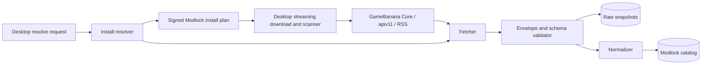

# GameBanana provider adapter

- **Status:** implementation specification, pending GameBanana approval
- **Last verified:** 2026-09-01
- **Provider key:** `gamebanana`
- **Game:** Deadlock / GameBanana game ID `20948`

This specification turns the dated findings in the [GameBanana teardown](../teardowns/gamebanana.md) into an isolated, testable boundary. It is intentionally stricter than a direct API wrapper.

## Goals and non-goals

The adapter will:

- discover public Deadlock `Mod` and `Sound` submissions;
- normalize provider data without erasing its provenance;
- preserve creator, credit, license, content-rating, category, file, and canonical-link state;
- resolve a selected file immediately before a desktop install;
- tolerate provider outages and additive schema drift;
- detect removals/state changes through paced reconciliation; and
- support GameBanana-negotiated one-click links without trusting their input.

The adapter will not:

- rehost or proxy GameBanana files;
- treat provider AV analysis as Modlock approval;
- scrape authenticated/private pages;
- automate likes, posts, downloads, or other user actions;
- bypass GameBanana download routing or choose arbitrary mirrors;
- infer creator consent, redistribution rights, or pro/streamer endorsement;
- expose raw provider HTML to a browser or native web renderer; or
- promise catalog completeness when GameBanana is unavailable.

## Boundary and ownership



The provider adapter owns network behavior, source schemas, raw snapshots, normalization, drift alarms, and install-time external resolution. Catalog/domain code sees provider-neutral records plus explicit provenance. The desktop never consumes `apiv11` directly.

## Configuration

Configuration is environment-scoped and contains no user credentials by default:

```text
GAMEBANANA_ENABLED=true
GAMEBANANA_GAME_ID=20948
GAMEBANANA_CORE_BASE_URL=https://api.gamebanana.com
GAMEBANANA_V11_BASE_URL=https://gamebanana.com/apiv11
GAMEBANANA_REQUESTS_PER_SECOND=1
GAMEBANANA_MAX_CONCURRENCY=2
GAMEBANANA_TIMEOUT_MS=15000
GAMEBANANA_MAX_JSON_BYTES=8388608
GAMEBANANA_INDEX_PAGE_SIZE=50
GAMEBANANA_CIRCUIT_FAILURE_THRESHOLD=5
GAMEBANANA_CIRCUIT_OPEN_SECONDS=300
GAMEBANANA_USER_AGENT=Modlock/<version> (+<contact-url>)
```

The rate and concurrency defaults are Modlock's conservative limits, not GameBanana-published limits. Production values cannot be raised until GameBanana confirms them in writing.

Base URLs and redirect host policy are deploy-time configuration but may only be changed through reviewed code/configuration. They are never accepted from a user or deep link.

## Stable external identities

Do not use mutable title, slug, filename, URL, category name, or version text as identity.

```text
External submission: (provider, submission_type, submission_id)
External file:       (provider, submission_type, submission_id, file_id)
Remote category:     (provider, category_model, category_id)
Remote creator:      (provider, member_id)
```

Allowed `submission_type` values at this boundary are `Mod` and `Sound`. IDs are positive base-10 integers serialized as strings internally to avoid cross-language width assumptions.

Recommended persistence model:

```sql
external_submissions(
  provider, submission_type, submission_id,
  canonical_url, remote_state, initial_visibility,
  title, summary_text, body_text,
  submitted_at, modified_at, remote_updated_at,
  creator_member_id, creator_display_name, creator_profile_url,
  content_rating_state, license_state,
  last_seen_at, last_fetched_at, unavailable_at,
  raw_payload_sha256, normalizer_version
)

external_files(
  provider, submission_type, submission_id, file_id,
  filename, byte_size, provider_md5,
  resolver_url, file_version, description,
  provider_analysis_state, provider_analysis_result,
  provider_av_state, provider_av_result,
  active_state, first_seen_at, last_seen_at,
  raw_payload_sha256
)
```

Raw provider payloads are stored separately with strict retention/access controls. Public APIs return normalized/sanitized fields, never raw blobs.

## Source strategy

Use each GameBanana surface for the task it is best suited to:

| Need | Primary source | Fallback/secondary | Notes |
|---|---|---|---|
| Bootstrap game and installer metadata | `apiv11/Game/20948/ProfilePage` | None | Also validates game identity and current manager metadata. |
| Full Mod discovery | `apiv11/Mod/Index` | None | Page through at maximum 50 only when provider budget permits. |
| Full Sound discovery | `apiv11/Sound/Index` | None | Separate identity namespace. |
| Fast new-item hint | documented `Rss/New?gameid=20948` | `Core/List/New` | Hints trigger detail fetch; never infer deletion. |
| Submission detail | `apiv11/{type}/{id}/ProfilePage` | selected Core `Item/Data` fields | Core fallback is incomplete but can distinguish some degraded states. |
| Current install files/state | `apiv11/{type}/{id}/DownloadPage` | ProfilePage `_aFiles` | Always refresh at install time. |
| Provider fields discovery | documented Core `AllowedFields`/`AllowedItemTypes` | None | Drift monitoring only. |
| Presentation ranking | `Game/20948/TopSubs`, `Util/List/Featured` | local metrics | Never affects catalog correctness. |
| Download bytes | provider file's `/mmdl` or `/dl` resolver as approved | None | Do not construct a filecache URL. |

`apiv11` remains an observed dependency until GameBanana confirms it. Every call is behind a kill switch.

## Catalog synchronization

### Incremental path

1. Poll the documented SFW RSS/New feed at the approved interval.
2. Parse only canonical GameBanana Mod/Sound URLs for game 20948.
3. Deduplicate by external submission identity.
4. Queue profile refresh with a unique idempotency key.
5. Fetch ProfilePage; confirm `_aGame._idRow == 20948` and route model matches.
6. Fetch DownloadPage only for public records with files.
7. Normalize and commit submission/files in one database transaction.
8. Enqueue media refresh separately; media failure does not roll back core metadata.

RSS is a latency optimization only. It excludes NSFW and does not communicate deletion/withholding.

### Full reconciliation

For each of `Mod` and `Sound`:

1. Request page 1 with `_nPerpage=50` and the encoded `Generic_Game=20948` filter.
2. Validate the complete envelope, error discriminator absence, and metadata bounds.
3. Record a `sync_run_id`, start time, reported count, and raw payload digest.
4. Upsert/dedupe each record by provider identity.
5. Continue one-based pages until `_bIsComplete == true`.
6. A page that is empty and complete ends the walk; an unexpected empty/incomplete page fails the run.
7. Do not mark omissions unavailable until the entire run succeeded.
8. Re-fetch candidates missing from a successful run directly before changing state.
9. Reconcile public details/files in a paced queue, prioritizing changed timestamps and active installs.
10. Commit a run summary and schema fingerprints.

Because there is no snapshot token, a sweep can race with updates. Deletion requires two signals: omission from a successful sweep plus a direct profile result indicating unavailable, or repeated successful omissions across the agreed grace window.

### Detail refresh triggers

Refresh a profile when:

- it is newly discovered;
- index `modified`/`updated` changes;
- an install is requested;
- it is present in a public pack/preset page nearing publication;
- a report/takedown is received;
- its cache TTL expires and a user views detail; or
- reconciliation targets it due to omission/state ambiguity.

## Install-time resolution

The external file resolver returns a Modlock-signed plan; it never returns a raw provider response.

Request:

```json
{
  "provider": "gamebanana",
  "submission_type": "Mod",
  "submission_id": "123456",
  "file_id": "654321",
  "expected_provider_md5": "optional-32-hex",
  "expected_byte_size": 38084704
}
```

Resolution algorithm:

1. Validate type/IDs/size bounds and authentication/authorization.
2. Fetch a fresh DownloadPage through the provider circuit breaker.
3. Reject `_bIsTrashed`, `_bIsWithheld`, private/unavailable, invalid schema, or policy-blocked content.
4. Locate the exact `file_id` in active files. Do not select the first file.
5. If only archived, require an explicit pinned-release flow and stronger warning; never silently substitute an active file.
6. Verify byte size and provider MD5 against the pack/catalog expectation when present.
7. Verify the resolver URL uses HTTPS, approved GameBanana host, no credentials, no fragment, and exact recognized route.
8. Emit a short-lived signed plan containing provider identity, source page, filename, size, provider MD5, resolver URL, rating/license warnings, and expiry.
9. Desktop follows redirects with per-hop validation, streams bytes to staging, enforces size, calculates MD5 and SHA-256, and runs independent scanning.
10. Desktop records final SHA-256, redirect-origin class, and provider identities in the local install journal.

No server-side proxy is used. Resolved URLs are never treated as permanent.

Sanitized plan:

```json
{
  "schema_version": 1,
  "resolution_id": "res_example",
  "expires_at": "2026-09-01T08:15:00Z",
  "source": {
    "provider": "gamebanana",
    "submission_type": "Mod",
    "submission_id": "123456",
    "file_id": "654321",
    "canonical_page": "https://gamebanana.com/mods/123456"
  },
  "file": {
    "filename": "example.zip",
    "byte_size": 38084704,
    "provider_md5": "00000000000000000000000000000000",
    "download_url": "https://gamebanana.com/mmdl/654321"
  },
  "warnings": [],
  "signature": "detached-server-signature"
}
```

The all-zero checksum is illustrative only and must be rejected by real checksum validation.

## One-click deep-link handling

GameBanana decides an integrated manager's protocol with the manager developer. Until that agreement exists, the examples below are internal targets, not a registered public format.

Preferred design:

```text
modlock://install/gamebanana?type=Mod&submission=123456&file=654321
```

If GameBanana requires the legacy comma form:

```text
modlock:https://gamebanana.com/mmdl/654321,Mod,123456
```

The desktop handler must:

- register only the exact `modlock` protocol under the signed installer;
- bound the complete argument length;
- reject control characters, duplicate keys, unexpected components, nondecimal IDs, unknown types, and extra tokens;
- treat embedded URLs as hints and independently extract only the file ID from an exact approved route;
- send normalized identities to the Modlock API for fresh resolution;
- show canonical source, creator, file, size, risk, and requested actions before first install;
- require an explicit user gesture; and
- never run commands or accept target paths from the deep link.

A browser page, chat message, QR code, or malicious local process can invoke a custom protocol. GameBanana branding in a link does not authenticate its origin.

## Normalized mapping

### Submission

| GameBanana | Modlock | Rule |
|---|---|---|
| `_sModelName` / route type | `source.item_type` | Allow exactly `Mod` or `Sound`; route and body must agree. |
| `_idRow` | `source.submission_id` | Positive integer, stored as string. |
| `_sProfileUrl` | `source.canonical_page` | Reconstruct from validated type/ID if malformed; never accept another host. |
| `_sName` | `title` | Plain text; Unicode normalize, length bound, escape on render. |
| `_sDescription` | `summary` | Sanitize/convert to plain text; do not trust HTML. |
| `_sText` | `body` | Sanitize with a strict provider policy; rewrite links; no active content. |
| `_tsDateAdded` | `published_at` | Unix seconds; reject impossible range; allow missing. |
| `_tsDateModified` | `source_modified_at` | Unix seconds; not an immutable release timestamp. |
| `_sVersion` | `source_version_label` | Optional display text only; file ID defines release identity. |
| `_aSubmitter` | `source.submitter` | Keep member ID, display name, canonical member link. |
| `_aCredits` | `credits[]` | Preserve groups and roles; do not merge with submitter. |
| `_aGame._idRow` | `game.source_id` | Must equal 20948. |
| `_aCategory`, `_aSuperCategory`, index root/subcategory | `source_categories[]` | Preserve IDs/names/hierarchy and map separately. |
| `_aTags` | `source_tags[]` | Accept observed string or key/value variants. |
| `_aPreviewMedia` | `media_refs[]` | HTTPS GameBanana media only; fetch/re-encode via controlled media worker if cached. |
| `_bIsObsolete` | `source_state=obsolete` | Keep visible with warning/replacement if known. |
| `_bIsPrivate`, `_bIsWithheld`, `_bIsTrashed` | unavailable states | Any true blocks new install/public display according to policy. |
| `_sInitialVisibility` | `source_visibility` | Preserve enum; unknown defaults to restricted. |
| `_aContentRatings` | `content_ratings[]` | Preserve code and label; unknown code is restrictive. |
| `_sLicense` | `license.raw_html` | Sanitize/parse; never render raw. |
| `_aLicenseChecklist` | `license.actions` | Normalize `yes/ask/no`; conflicts choose most restrictive. |
| `_aRequirements` | `source_requirements[]` | Preserve raw label/link/type; resolve GameBanana URLs only after validation. |

### File

| GameBanana | Modlock | Rule |
|---|---|---|
| `_idRow` | `source.file_id` | Immutable external file identity. |
| `_sFile` | `filename` | Display only; strip path, reject device/control names for local use. |
| `_nFilesize` | `byte_size` | Nonnegative integer under configured ceiling. |
| `_sDownloadUrl` | `source.resolver_url` | Exact approved HTTPS GameBanana resolver route only. |
| `_sMd5Checksum` | `provider_md5` | Exactly 32 hex when present; identity check, not sole security hash. |
| `_sVersion` | `source_version_label` | Optional, mutable text. |
| `_sDescription` | `file_note` | Sanitized plain text. |
| `_bIsArchived` / list membership | `active_state` | Active and archived are explicit; never infer from array order. |
| `_sAnalysisState`, `_sAnalysisResult*` | `provider_analysis` | Provenance only. Unknown enum is not clean. |
| `_sAvState`, `_sAvResult` | `provider_av` | Provenance only. Unknown/pending is not clean. |
| `_aModManagerIntegrations` | `provider_install_integrations[]` | Use only the entry matching Modlock after registration. |

### Category normalization

Map by remote category ID. Names are mutable labels.

```text
33295 -> cosmetic.skin
33154 -> cosmetic.model-replacement
31713 -> ui.hud
31710 -> other
46154 -> qol-or-fix
37225 -> map
33331 -> gameplay
47611 -> cosmetic.animation
```

Unknown categories map to `other.unclassified`, retain full source metadata, and enter a taxonomy-review queue. Category mapping never lowers scanner/policy risk.

Sound categories initially map by semantics only after review; always retain the remote source category. Examples observed include abilities, voice-over, in-game music, items, weapons, sound packs, movement, killsounds, and gameplay events.

## License, attribution, donation, and content rules

### Attribution output

Every public GameBanana-backed card/detail/install view must include:

```text
Hosted by GameBanana
Submitted by <linked submitter>
Additional credits <when present>
View original submission <canonical link>
License/permissions <structured summary plus source link>
```

Final wording is pending GameBanana approval.

### License state machine

```text
unknown
  -> parsed-explicit
  -> conflicting-needs-review
  -> changed-needs-review
```

For each action (`download_install`, `redistribute`, `modify`, `commercial`, `adult_use`), normalize to `yes`, `ask`, `no`, or `unknown`. `ask`, `no`, `unknown`, parser failure, or conflict blocks Modlock rehosting. Download/install through the provider can proceed only if source state and Modlock policy allow it.

The raw `_sLicense` is untrusted HTML. The raw checklist and digest are retained as evidence; the client receives plain structured values and a canonical GameBanana link.

### Donation links

Accept only a plain label and an `https` URL after URL parsing. Drop GameBanana formatting templates, inline HTML, validators, icons/classes, and unsupported schemes. Open external links with browser protections and no referrer where feasible. Do not rewrite, affiliate, collect, or imply verification.

### NSFW

- Index `has ratings=false` is not sufficient to mark SFW.
- Profile rating codes/labels are preserved; unknown codes are restrictive.
- `warn`, any adult rating, keyword detection, or missing ambiguous state enters the age/content gate.
- Media is not fetched into a public thumbnail cache until classification is known.
- RSS is documented as SFW-only and cannot enumerate the complete provider catalog.
- Modlock policy may prohibit content GameBanana allows.

## Network and parser security

### Request rules

- HTTPS only.
- Resolve and connect through the standard hardened HTTP client; block credentials in URLs.
- No user-supplied base URLs, proxy destinations, or DNS overrides.
- Timeout connect, headers, and body; impose a maximum JSON body size.
- Require expected content type, but still fail safely if a server mislabels an error.
- Decompress response bodies under a maximum expanded size.
- Never deserialize PHP/XML formats; request JSON only.
- Parse integers with checked bounds and timestamps with range validation.
- Unknown additive fields are retained in raw snapshots but ignored by domain code.
- Missing identity/state/file-integrity fields quarantine the record.

### Redirect policy

Validate every hop, not just the first and last. Initial approved resolver hosts are exact `gamebanana.com` routes returned by the API. Observed file hosts include `files.gamebanana.com` and numbered `filecacheNN.gamebanana.com`, but production patterns require GameBanana confirmation.

Do not implement allowlisting as `hostname.endsWith("gamebanana.com")`; that admits lookalike suffixes. Parse DNS names, lowercase/punycode-normalize, reject trailing-dot ambiguity, and compare exact hosts or validated labels beneath `gamebanana.com`.

Use at most five redirects, never forward credentials/cookies, require HTTPS on every hop, reject IP literals/private/link-local destinations, and stop if the final response is not a bounded downloadable file.

### Archive trust

Provider states such as `analysis=ok` and `av=clean` are displayable provenance, not authorization. The desktop still applies Modlock's size, path traversal, symlink/hardlink, device path, nested archive, executable, VPK, capability, and malware policies.

## Cache, retry, and request budget

Until GameBanana supplies written rules:

| Data | Proposed TTL | Install behavior |
|---|---:|---|
| Game bootstrap | 1 hour | Not installation authority. |
| Index page | 10 minutes | Not installation authority. |
| Public ProfilePage | 15 minutes | Refresh if install/report/state-sensitive. |
| DownloadPage | 5 minutes | Always bypass/refresh for install resolution. |
| Error `NO_SUCH_RECORD` | 5 minutes | Recheck before permanent state change. |
| Media metadata | 1 hour | Public cache only after content classification. |
| Raw payload | 30 days internal | Revisit after legal/privacy review. |

These are Modlock proposals, not granted cache rights.

Retry only idempotent GET/HEAD operations:

```text
timeout/network/502/503/504: up to 4 retries, exponential 1s..8s plus jitter
429: honor Retry-After; open provider circuit if repeated
400/404 or provider logical error: classify; no generic retry
schema/security error: no retry storm; open circuit and alert
```

Maximum concurrency starts at two and aggregate request rate at one per second across workers. A distributed limiter prevents each replica from independently consuming that budget.

## Provider state model

```text
healthy
degraded_stale
rate_limited
circuit_open
schema_drift
disabled_by_policy
```

The website may serve last-known normalized metadata in `degraded_stale`, clearly timestamped. Desktop resolution requires a fresh valid DownloadPage and fails closed when provider state cannot be verified. Existing local profiles continue to work offline; no source outage should mutate installed files.

## Observability and privacy

Metrics:

```text
gamebanana_requests_total{route_class,status_class,outcome}
gamebanana_request_duration_seconds{route_class}
gamebanana_response_bytes{route_class}
gamebanana_schema_failures_total{route_class,fingerprint}
gamebanana_records_seen_total{type}
gamebanana_reconciliation_omissions_total{type}
gamebanana_circuit_state
gamebanana_rate_limit_events_total
gamebanana_resolve_failures_total{reason}
```

Structured logs include correlation ID, route class, submission/file ID when needed, response status, latency, byte count, schema version/fingerprint, and outcome. Do not log raw descriptions, donation URLs, member profile content, deep-link strings, redirects with query secrets, or binary URLs beyond normalized host/route class.

Raw provider payload access is restricted to diagnostics/moderation roles and subject to retention policy. Public records can still contain personal data; data minimization and deletion handling apply.

## Contract test plan

### Sanitized fixture suite

Commit hand-sanitized fixtures with source URL class, capture date, response headers relevant to behavior, and SHA-256. Remove usernames, donation values, descriptions, and media not essential to the contract.

Required fixtures:

1. Mod index page, incomplete.
2. Mod index final non-empty page.
3. Mod index page beyond end.
4. Sound index with audio preview.
5. Game ProfilePage with categories and installer metadata.
6. Mod profile with multiple active files.
7. Profile with archived and active files.
8. Sound profile.
9. Rated/`warn` profile with unknown rating-code variant.
10. License checklist containing yes/ask/no.
11. Donation method with safe URL and malicious HTML/scheme mutations.
12. Withheld, trashed, private, and obsolete synthetic variants.
13. Provider 200 error object.
14. Non-JSON/mislabeled 200.
15. Null/missing/array-vs-object variants observed across Core and `apiv11`.
16. New additive fields and unknown enums.
17. Missing critical identity/file fields.
18. Redirect chain fixtures, including malicious off-domain/private-IP hops.

Do not commit actual mod archives unless licensing permits and the fixture register documents that permission.

### Parser properties

- Never panic on arbitrary JSON.
- Reject success envelopes containing logical errors.
- Additive fields do not fail normalization.
- Missing critical fields fail closed with an actionable reason.
- Unknown state/rating/license values become restrictive, never permissive.
- Normalization is deterministic and idempotent.
- Re-normalizing an unchanged raw digest produces byte-identical domain output.
- HTML sanitization removes scripts, handlers, CSS, embedded objects, and unsafe URLs.
- File and submission IDs cannot cross types or submissions.

### Mock integration tests

- pagination walk and last-page detection;
- record moves/duplicates between pages;
- incomplete empty page;
- timeout/429/5xx retry and distributed rate limiting;
- circuit opens, half-opens, and recovers;
- omission does not delete after a partial run;
- direct confirmation before unavailable state;
- install resolver refuses first-file fallback;
- size/MD5 mismatch blocks the plan;
- archived pin behavior;
- forged deep link and malicious redirect rejection;
- provider outage leaves existing local installs untouched.

### Low-impact live canaries

Run only at an approved interval and request rate:

1. Fetch `Game/20948/ProfilePage`; assert game ID and public state.
2. Fetch page 1 of Mod and Sound indexes with a small supported page size.
3. Select a current public `has files` record from the returned page; fetch its ProfilePage and DownloadPage.
4. Assert route/body type, game ID, submission ID, canonical host, file identity, and schema invariants.
5. Fetch Core AllowedFields and compare the field-set fingerprint.
6. Alert on drift; do not fail the entire product for additive changes.

Do not intentionally trigger rate limits. Do not use private/withheld records as canaries. Do not resolve/download a binary in a frequent canary because download-count semantics are unknown. A separately approved weekly `HEAD` redirect canary may validate routing without fetching the body.

### Acceptance gates

The adapter is implementation-ready only when:

- all fixture/property/mock tests pass;
- raw and normalized schemas are versioned;
- timeout, limiter, retry, circuit breaker, and kill switch are operational;
- HTML/media/deep-link/redirect security tests pass;
- the reconciliation deletion guard is proven;
- install resolution always checks fresh state and exact file identity;
- observability dashboards/alerts exist; and
- GameBanana has answered the launch-blocking questions below.

## Launch-blocking questions for GameBanana

The project owner must obtain written answers to these; engineering cannot close them through further public probes:

| Question | Why it blocks launch |
|---|---|
| Is `apiv11` an approved production dependency for Modlock? | It is the only observed rich full-catalog interface. |
| What rate/concurrency and reconciliation schedule are permitted? | Determines sync architecture and protects GameBanana. |
| What metadata/media can be cached, for how long, and with what attribution? | Required for the website catalog and privacy/IP operations. |
| Must manager downloads use `/mmdl`, and how are counts/analytics attributed? | Prevents bypassing expected reporting. |
| Can local desktop archives be retained for reinstall/rollback? | Core offline/profile behavior depends on it. |
| What is the one-click registration, testing, signing, and revocation process? | Needed before a public protocol can appear on GameBanana. |
| How are archive opt-outs exposed for a registered manager? | Modlock must honor creator `.disable_gb1click*` choices. |
| Is there a webhook/removal feed or required takedown reconciliation interval? | Determines how quickly Modlock hides revoked content. |
| Which count/scope and NSFW/paid semantics should partners present? | Prevents misleading catalog claims and policy errors. |
| What operational/security escalation channel should Modlock use? | Needed for outages, malicious files, compromised accounts, and urgent takedowns. |

Until answered, the adapter may be developed and tested against public low-rate reads, but production catalog import, public attribution language, cache retention, and one-click registration remain blocked.

## Implementation checklist

- [ ] Obtain GameBanana written approval/answers.
- [ ] Define JSON Schemas for every consumed envelope.
- [ ] Add provider configuration and distributed request limiter.
- [ ] Implement bounded fetcher, retries, circuit breaker, and kill switch.
- [ ] Implement raw snapshot store with digest and retention controls.
- [ ] Implement index/ProfilePage/DownloadPage normalizers.
- [ ] Implement attribution, license/checklist, donation, NSFW, and state mapping.
- [ ] Implement full sweep and RSS-triggered incremental refresh.
- [ ] Implement two-signal removal reconciliation.
- [ ] Implement exact-file install resolution and signed plan.
- [ ] Implement desktop deep-link parser and redirect validator.
- [ ] Add fixture/property/mock/live-canary tests.
- [ ] Add metrics, dashboards, alerts, and provider operations runbook.
- [ ] Security and legal review before enabling production ingestion.

## Primary references

- [GameBanana API documentation](https://api.gamebanana.com/)
- [Core Item Data](https://api.gamebanana.com/docs/endpoints/Core/Item/Data)
- [Core List New](https://api.gamebanana.com/docs/endpoints/Core/List/New)
- [Deadlock hub](https://gamebanana.com/games/20948)
- [1-Click Mod Installers](https://gamebanana.com/wikis/1999)
- [Terms of Service](https://gamebanana.com/wikis/334)
- [DMCA Policy](https://gamebanana.com/wikis/677)
- [Indecent Content Rules](https://gamebanana.com/wikis/1980)
- [Age Restrictions](https://gamebanana.com/wikis/2036)
- [Paid Content Setting](https://gamebanana.com/wikis/2374)

The accompanying [teardown](../teardowns/gamebanana.md) records which claims are confirmed, observed, inferred, or unknown and contains the dated endpoint evidence.
