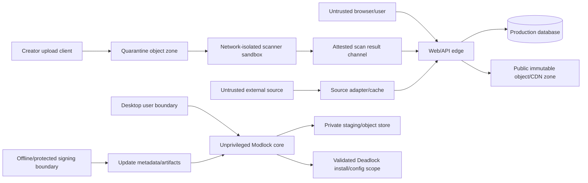

# Formal threat model

Status: design review baseline; requires external review before beta  
Last reviewed: 2026-09-01

## Trust zones

Crossing a boundary requires validation, least-privilege credentials, time/size limits, auditability, and an explicit failure mode.

## Assets

- User Windows account, game installation, CFGs, Steam library, and authentication tokens.
- Creator identity, files, licenses, private drafts, and reputation.
- Catalog/release/pack/preset integrity and provenance.
- Database, quarantine/public objects, scan attestations, audit logs, backups.
- Moderator/admin accounts and signing/update keys.

## Abuse cases and controls

| Threat | Boundary/control | Verification |
|---|---|---|
| Archive path traversal/reparse escape | Fresh private staging, canonical relative paths, reject links/devices/ADS, post-extract walk | Adversarial fixtures + fuzzing |
| Compression/resource bomb | Compressed/expanded/count/depth/time/memory ceilings at worker/parser | Limit fixtures + sandbox metrics |
| Parser memory corruption | Memory-safe parsers where possible, isolation, fuzzing, dependency response | Continuous fuzz + external review |
| Malicious executable content | Ordinary mod types reject EXE/DLL/driver/script; never execute payload | Magic/inventory fixtures |
| Unauthorized game/config write | Validated root, owned marker blocks, transaction plan/journal, no admin | Failure-injection and scope assertions |
| Install-plan tampering/replay | HTTPS plus Ed25519 signed canonical plan, expiry, nonce/replay store, allowlisted host/size/hash | Signature/replay tests |
| External URL swaps bytes | Hash when available; otherwise fresh scan + stronger warning/receipt | Changed-byte adapter fixture |
| Creator account takeover | Passkeys/MFA, step-up, session/device revocation, immutable publication audit | Auth threat tests/tabletop |
| Moderator/admin abuse | Capability roles, dual control for critical actions, append-only audit/export | Access review and action replay |
| Scanner-to-production pivot | No outbound network, no publish credential, narrow result channel, sandbox disposal | Infrastructure policy tests |
| Quarantine made public | Separate account/bucket/policy, automated access-policy tests | Continuous cloud policy check |
| Update/signing compromise | Scoped online targets key, protected/offline root/recovery, expiry/rollback protection, reproducible evidence | Signing ceremony/compromise drill |
| Cache poisoning/schema confusion | Provider-specific cache keys, schema validation, canonical identity, circuit breaker | Contract and poisoning tests |
| XSS/media exploit | Strict output encoding/CSP, media re-encoding, isolated original delivery, no HTML license rendering without sanitization | Web security tests |
| SSRF | Source adapters use allowlisted origins/redirect policy; scanner no network; user URLs not server-fetched generically | SSRF test corpus |
| IDOR/authorization bypass | Central authorization on every object/action; opaque IDs not treated as access control | Role matrix integration tests |
| Impersonation/fake endorsement | Separate identity and artifact approval records; exact version digest, expiry/revocation | Workflow tests and audit |
| Cheat content | Capability/effect-based policy, automated hints plus human review, report/emergency revoke | Moderation scenarios |
| Privacy leakage in logs/analytics | Structured allowlist, redaction, local diagnostics preview/consent, short retention | Log tests and privacy review |

## Security assumptions

- The OS, Steam, and Deadlock installation owner controls the machine.
- Modlock cannot guarantee that third-party cosmetic files are permitted by Valve; policy risk is disclosed and kill-switchable.
- Malware scanners cannot prove safety; structural restrictions and no-execution are primary defenses.
- Code signing identifies the publisher/integrity, not that every build is bug-free.

## Review gates

Threat model updates are required when adding a parser/archive type, new external source, executable/plugin capability, identity provider, payment, public comments, background service, updater/key role, or new game mutation surface.

